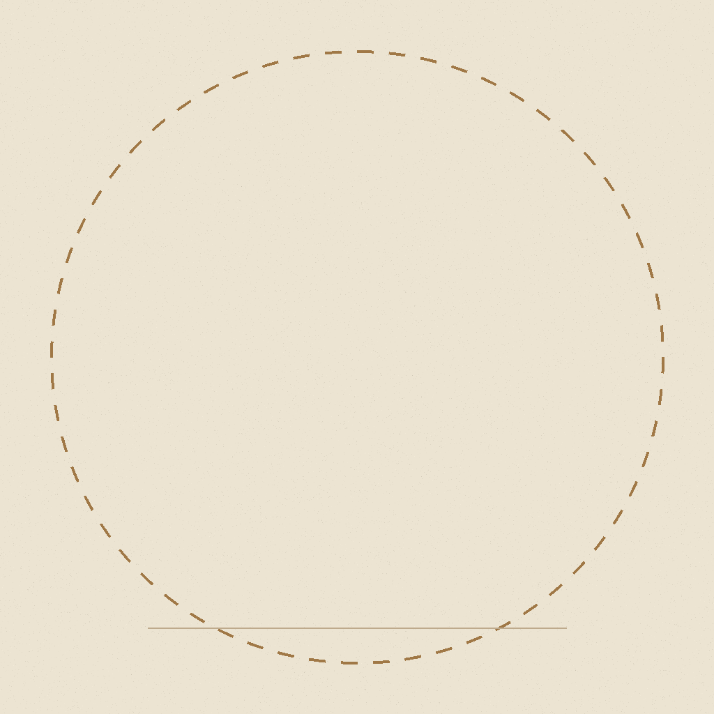
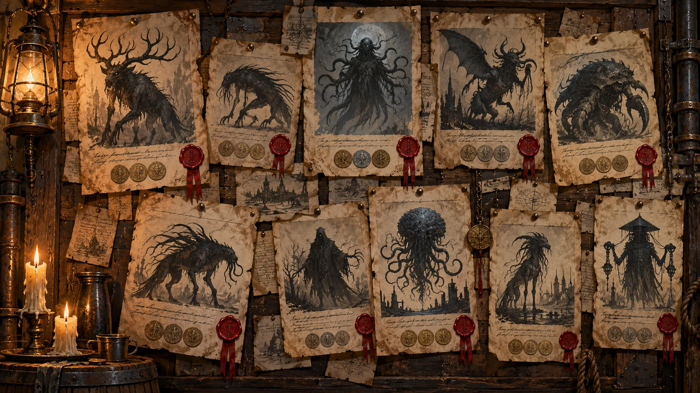

# B. Creature Silhouettes and Combat Art

| # | Image | Used in | File name | Size |
|---|---|---|---|---|
| 1 | Combat art — first phase | Combat screen | `<CODE>__combat__normal.png` | 2:3 (1024×1536) |
| 2 | Combat art — second phase | After the phase change | `<CODE>__combat__phase2.png` | 2:3 (1024×1536) |
| 3 | Leaflet silhouette | Leaflets, contract tablet, tracker | `<CODE>__silhouette__leaflet.png` | 1:1 (1024×1024) |
| 4 | Cracked silhouette | After the phase is seen; Bestiary | `<CODE>__silhouette__cracked.png` | 1:1 (1024×1024) |

> **Order:** 1 → 2 → 3 → 4 in ONE chat per creature, always attaching the previous result — the silhouette is cut from the combat art, so they always match.

## Rules

- **Silhouettes:** flat black #120D0B, transparent background, readable at 96 px, inside the circle of `LEAFLET__frame.png` (the round frame of the contract tablet).
- **Combat art:** transparent background, inside the safe area of `COMBAT__frame.png`, on the ground ellipse; mostly shadow with rim light.
- **Body parts** named in the prompt must be visible and separate — they become click targets in combat.
- Same pose, camera and scale for phase 1 and 2 (the game cross-fades them). Wrong proportions, not gore.





## Prompts

Files go to `assets/monsters/`.

### Gutter Choir — `GUTTER_CHOIR` · rank A

| Field | Value |
|---|---|
| Body parts | Left Throat, Right Throat |
| Phase 2 | The song rises (at 50% HP) |
| Rumor tags | children singing, wet handprints, near water, during rain, drowned shallow |

**1 — Combat art, first phase**

```text
[STYLE BLOCK]
Attached: COMBAT__frame.png (framing guide), TAVERN__contract_board (silhouette style reference).
Full-body art of the creature "Gutter Choir" (danger rank A) for the combat screen.
The creature: a cluster of pale, child-sized drowned figures fused at the shoulders into one dripping mass that rises out of a storm drain; two long throats stretch up like organ pipes, wet handprints all over its skin.
Mostly in deep shadow, lit by a cold rim light from behind and a weak warm light from the front;
slightly turned (3/4 view), standing on the ground line of the frame, filling the dashed safe area.
These body parts must be clearly visible and separate from each other (the player aims at them):
Left Throat, Right Throat.
Wrong proportions rather than gore. Transparent background, no floor, no text.
Output: transparent PNG, 2:3 portrait (1024×1536).
```

**2 — Combat art, second phase**

```text
[STYLE BLOCK]
Attached: GUTTER_CHOIR__combat__normal.png (the same creature, first phase).
Repaint THE SAME CREATURE in the same pose, camera, scale and position — its second phase
"The song rises":
the mass splits open into a ring of singing mouths, water pouring from every throat, the children's faces stretched into one long scream.
Keep the body parts Left Throat, Right Throat in the same places; broken-looking is fine.
Stronger glow, more threatening. Transparent background, no text.
Output: transparent PNG, 2:3 portrait (1024×1536).
```

**3 — Leaflet silhouette**

```text
[STYLE BLOCK]
Attached: GUTTER_CHOIR__combat__normal.png (the creature), LEAFLET__frame.png (size guide),
TAVERN__contract_board (how silhouettes look on hunters' leaflets).
A pure flat black silhouette (#120D0B) of the attached creature, as drawn on a hunters' contract
leaflet by a witness: same pose, slightly exaggerated, readable even at 96 px.
No inner details, no eyes, no shading, no outline of another colour.
It must fit inside the dashed circle of the frame with a little margin, standing on the line.
Transparent background (do not paint the parchment). No text.
Output: transparent PNG, 1:1 (1024×1024).
```

**4 — Cracked silhouette**

```text
[STYLE BLOCK]
Attached: GUTTER_CHOIR__silhouette__leaflet.png, GUTTER_CHOIR__combat__phase2.png.
The SAME black silhouette, cracked like broken porcelain: through thin glowing cracks a glimpse of
the creature's true form shows (the mass splits open into a ring of singing mouths, water pouring from every throat, the children's faces stretched into one long scream).
Keep the outline identical. Transparent background, no text.
Output: transparent PNG, 1:1 (1024×1024).
```

### Moth Matron — `MOTH_MATRON` · rank A

| Field | Value |
|---|---|
| Body parts | Wings |
| Phase 2 | The swarm wakes (at 40% HP) |
| Rumor tags | dust on sleepers, moonlight, never wake, silent wings |

**1 — Combat art, first phase**

```text
[STYLE BLOCK]
Attached: COMBAT__frame.png (framing guide), TAVERN__contract_board (silhouette style reference).
Full-body art of the creature "Moth Matron" (danger rank A) for the combat screen.
The creature: a tall moth-woman in a ragged nightgown made of grey wings, huge dusty compound eyes, thin arms cradling silk cocoons with sleeping people inside.
Mostly in deep shadow, lit by a cold rim light from behind and a weak warm light from the front;
slightly turned (3/4 view), standing on the ground line of the frame, filling the dashed safe area.
These body parts must be clearly visible and separate from each other (the player aims at them):
Wings.
Wrong proportions rather than gore. Transparent background, no floor, no text.
Output: transparent PNG, 2:3 portrait (1024×1536).
```

**2 — Combat art, second phase**

```text
[STYLE BLOCK]
Attached: MOTH_MATRON__combat__normal.png (the same creature, first phase).
Repaint THE SAME CREATURE in the same pose, camera, scale and position — its second phase
"The swarm wakes":
the nightgown opens into enormous wings covered in eye-patterns, a cloud of smaller moths pouring out of her body.
Keep the body parts Wings in the same places; broken-looking is fine.
Stronger glow, more threatening. Transparent background, no text.
Output: transparent PNG, 2:3 portrait (1024×1536).
```

**3 — Leaflet silhouette**

```text
[STYLE BLOCK]
Attached: MOTH_MATRON__combat__normal.png (the creature), LEAFLET__frame.png (size guide),
TAVERN__contract_board (how silhouettes look on hunters' leaflets).
A pure flat black silhouette (#120D0B) of the attached creature, as drawn on a hunters' contract
leaflet by a witness: same pose, slightly exaggerated, readable even at 96 px.
No inner details, no eyes, no shading, no outline of another colour.
It must fit inside the dashed circle of the frame with a little margin, standing on the line.
Transparent background (do not paint the parchment). No text.
Output: transparent PNG, 1:1 (1024×1024).
```

**4 — Cracked silhouette**

```text
[STYLE BLOCK]
Attached: MOTH_MATRON__silhouette__leaflet.png, MOTH_MATRON__combat__phase2.png.
The SAME black silhouette, cracked like broken porcelain: through thin glowing cracks a glimpse of
the creature's true form shows (the nightgown opens into enormous wings covered in eye-patterns, a cloud of smaller moths pouring out of her body).
Keep the outline identical. Transparent background, no text.
Output: transparent PNG, 1:1 (1024×1024).
```

### The Lamplighter — `LAMPLIGHTER` · rank P

| Field | Value |
|---|---|
| Body parts | Lantern, Long Hands |
| Phase 2 | The light goes out (at 50% HP) |
| Rumor tags | lamps die, too tall, only in fog, burnt eyes |

**1 — Combat art, first phase**

```text
[STYLE BLOCK]
Attached: COMBAT__frame.png (framing guide), TAVERN__contract_board (silhouette style reference).
Full-body art of the creature "The Lamplighter" (danger rank P) for the combat screen.
The creature: an impossibly tall, thin figure in a long coat and stovepipe hat, carrying a lamplighter's pole with a lantern of black flame, its hands too long with too many joints.
Mostly in deep shadow, lit by a cold rim light from behind and a weak warm light from the front;
slightly turned (3/4 view), standing on the ground line of the frame, filling the dashed safe area.
These body parts must be clearly visible and separate from each other (the player aims at them):
Lantern, Long Hands.
Wrong proportions rather than gore. Transparent background, no floor, no text.
Output: transparent PNG, 2:3 portrait (1024×1536).
```

**2 — Combat art, second phase**

```text
[STYLE BLOCK]
Attached: LAMPLIGHTER__combat__normal.png (the same creature, first phase).
Repaint THE SAME CREATURE in the same pose, camera, scale and position — its second phase
"The light goes out":
the hat and face burn away to a hollow lantern-head full of black fire; the long hands unfold like spider legs.
Keep the body parts Lantern, Long Hands in the same places; broken-looking is fine.
Stronger glow, more threatening. Transparent background, no text.
Output: transparent PNG, 2:3 portrait (1024×1536).
```

**3 — Leaflet silhouette**

```text
[STYLE BLOCK]
Attached: LAMPLIGHTER__combat__normal.png (the creature), LEAFLET__frame.png (size guide),
TAVERN__contract_board (how silhouettes look on hunters' leaflets).
A pure flat black silhouette (#120D0B) of the attached creature, as drawn on a hunters' contract
leaflet by a witness: same pose, slightly exaggerated, readable even at 96 px.
No inner details, no eyes, no shading, no outline of another colour.
It must fit inside the dashed circle of the frame with a little margin, standing on the line.
Transparent background (do not paint the parchment). No text.
Output: transparent PNG, 1:1 (1024×1024).
```

**4 — Cracked silhouette**

```text
[STYLE BLOCK]
Attached: LAMPLIGHTER__silhouette__leaflet.png, LAMPLIGHTER__combat__phase2.png.
The SAME black silhouette, cracked like broken porcelain: through thin glowing cracks a glimpse of
the creature's true form shows (the hat and face burn away to a hollow lantern-head full of black fire).
Keep the outline identical. Transparent background, no text.
Output: transparent PNG, 1:1 (1024×1024).
```

### Rust Mantis — `RUST_MANTIS` · rank P

| Field | Value |
|---|---|
| Body parts | Left Scythe, Right Scythe |
| Phase 2 | Rust frenzy (at 50% HP) |
| Rumor tags | grinding metal, acid burns, foundries, eats machinery |

**1 — Combat art, first phase**

```text
[STYLE BLOCK]
Attached: COMBAT__frame.png (framing guide), TAVERN__contract_board (silhouette style reference).
Full-body art of the creature "Rust Mantis" (danger rank P) for the combat screen.
The creature: a mantis made of corroded iron plates and wet sinew, two scythe arms built from old saw blades, acid dripping from its jaws, sparks where metal grinds.
Mostly in deep shadow, lit by a cold rim light from behind and a weak warm light from the front;
slightly turned (3/4 view), standing on the ground line of the frame, filling the dashed safe area.
These body parts must be clearly visible and separate from each other (the player aims at them):
Left Scythe, Right Scythe.
Wrong proportions rather than gore. Transparent background, no floor, no text.
Output: transparent PNG, 2:3 portrait (1024×1536).
```

**2 — Combat art, second phase**

```text
[STYLE BLOCK]
Attached: RUST_MANTIS__combat__normal.png (the same creature, first phase).
Repaint THE SAME CREATURE in the same pose, camera, scale and position — its second phase
"Rust frenzy":
the plates flare open like a rusted crown, steam and acid spraying from the joints, the scythes glowing red-hot.
Keep the body parts Left Scythe, Right Scythe in the same places; broken-looking is fine.
Stronger glow, more threatening. Transparent background, no text.
Output: transparent PNG, 2:3 portrait (1024×1536).
```

**3 — Leaflet silhouette**

```text
[STYLE BLOCK]
Attached: RUST_MANTIS__combat__normal.png (the creature), LEAFLET__frame.png (size guide),
TAVERN__contract_board (how silhouettes look on hunters' leaflets).
A pure flat black silhouette (#120D0B) of the attached creature, as drawn on a hunters' contract
leaflet by a witness: same pose, slightly exaggerated, readable even at 96 px.
No inner details, no eyes, no shading, no outline of another colour.
It must fit inside the dashed circle of the frame with a little margin, standing on the line.
Transparent background (do not paint the parchment). No text.
Output: transparent PNG, 1:1 (1024×1024).
```

**4 — Cracked silhouette**

```text
[STYLE BLOCK]
Attached: RUST_MANTIS__silhouette__leaflet.png, RUST_MANTIS__combat__phase2.png.
The SAME black silhouette, cracked like broken porcelain: through thin glowing cracks a glimpse of
the creature's true form shows (the plates flare open like a rusted crown, steam and acid spraying from the joints, the scythes glowing red-hot).
Keep the outline identical. Transparent background, no text.
Output: transparent PNG, 1:1 (1024×1024).
```

### Mourning Bride — `MOURNING_BRIDE` · rank P

| Field | Value |
|---|---|
| Body parts | Veil, Hand Mirror |
| Phase 2 | The mirror cracks (at 50% HP) |
| Rumor tags | covered mirrors, one guest too many, victim smiling, perfume |

**1 — Combat art, first phase**

```text
[STYLE BLOCK]
Attached: COMBAT__frame.png (framing guide), TAVERN__contract_board (silhouette style reference).
Full-body art of the creature "Mourning Bride" (danger rank P) for the combat screen.
The creature: a bride in a black veil and a tattered wedding dress, holding a silver hand mirror; her fingers are too many and too long; the reflection in the mirror is not her.
Mostly in deep shadow, lit by a cold rim light from behind and a weak warm light from the front;
slightly turned (3/4 view), standing on the ground line of the frame, filling the dashed safe area.
These body parts must be clearly visible and separate from each other (the player aims at them):
Veil, Hand Mirror.
Wrong proportions rather than gore. Transparent background, no floor, no text.
Output: transparent PNG, 2:3 portrait (1024×1536).
```

**2 — Combat art, second phase**

```text
[STYLE BLOCK]
Attached: MOURNING_BRIDE__combat__normal.png (the same creature, first phase).
Repaint THE SAME CREATURE in the same pose, camera, scale and position — its second phase
"The mirror cracks":
the mirror cracks and her reflection climbs out of it; two brides joined at the back, veils torn, glass shards circling them.
Keep the body parts Veil, Hand Mirror in the same places; broken-looking is fine.
Stronger glow, more threatening. Transparent background, no text.
Output: transparent PNG, 2:3 portrait (1024×1536).
```

**3 — Leaflet silhouette**

```text
[STYLE BLOCK]
Attached: MOURNING_BRIDE__combat__normal.png (the creature), LEAFLET__frame.png (size guide),
TAVERN__contract_board (how silhouettes look on hunters' leaflets).
A pure flat black silhouette (#120D0B) of the attached creature, as drawn on a hunters' contract
leaflet by a witness: same pose, slightly exaggerated, readable even at 96 px.
No inner details, no eyes, no shading, no outline of another colour.
It must fit inside the dashed circle of the frame with a little margin, standing on the line.
Transparent background (do not paint the parchment). No text.
Output: transparent PNG, 1:1 (1024×1024).
```

**4 — Cracked silhouette**

```text
[STYLE BLOCK]
Attached: MOURNING_BRIDE__silhouette__leaflet.png, MOURNING_BRIDE__combat__phase2.png.
The SAME black silhouette, cracked like broken porcelain: through thin glowing cracks a glimpse of
the creature's true form shows (the mirror cracks and her reflection climbs out of it).
Keep the outline identical. Transparent background, no text.
Output: transparent PNG, 1:1 (1024×1024).
```

### Vigil Hound — `VIGIL_HOUND` · rank P

| Field | Value |
|---|---|
| Body parts | Jaw, Hind Legs |
| Phase 2 | The hunter is gone (at 50% HP) |
| Rumor tags | howl, prints turn to paws, smell of medicine, former hunter |

**1 — Combat art, first phase**

```text
[STYLE BLOCK]
Attached: COMBAT__frame.png (framing guide), TAVERN__contract_board (silhouette style reference).
Full-body art of the creature "Vigil Hound" (danger rank P) for the combat screen.
The creature: a former monster hunter caught halfway into a huge wolf-like beast: torn hunter's coat and belts still on its body, empty syringes stuck in the fur, one human hand left.
Mostly in deep shadow, lit by a cold rim light from behind and a weak warm light from the front;
slightly turned (3/4 view), standing on the ground line of the frame, filling the dashed safe area.
These body parts must be clearly visible and separate from each other (the player aims at them):
Jaw, Hind Legs.
Wrong proportions rather than gore. Transparent background, no floor, no text.
Output: transparent PNG, 2:3 portrait (1024×1536).
```

**2 — Combat art, second phase**

```text
[STYLE BLOCK]
Attached: VIGIL_HOUND__combat__normal.png (the same creature, first phase).
Repaint THE SAME CREATURE in the same pose, camera, scale and position — its second phase
"The hunter is gone":
the last human parts are gone: a massive hound with a split jaw, the hunter's hat snagged on one ear, eyes burning like lamps.
Keep the body parts Jaw, Hind Legs in the same places; broken-looking is fine.
Stronger glow, more threatening. Transparent background, no text.
Output: transparent PNG, 2:3 portrait (1024×1536).
```

**3 — Leaflet silhouette**

```text
[STYLE BLOCK]
Attached: VIGIL_HOUND__combat__normal.png (the creature), LEAFLET__frame.png (size guide),
TAVERN__contract_board (how silhouettes look on hunters' leaflets).
A pure flat black silhouette (#120D0B) of the attached creature, as drawn on a hunters' contract
leaflet by a witness: same pose, slightly exaggerated, readable even at 96 px.
No inner details, no eyes, no shading, no outline of another colour.
It must fit inside the dashed circle of the frame with a little margin, standing on the line.
Transparent background (do not paint the parchment). No text.
Output: transparent PNG, 1:1 (1024×1024).
```

**4 — Cracked silhouette**

```text
[STYLE BLOCK]
Attached: VIGIL_HOUND__silhouette__leaflet.png, VIGIL_HOUND__combat__phase2.png.
The SAME black silhouette, cracked like broken porcelain: through thin glowing cracks a glimpse of
the creature's true form shows (the last human parts are gone: a massive hound with a split jaw, the hunter's hat snagged on one ear, eyes burning like lamps).
Keep the outline identical. Transparent background, no text.
Output: transparent PNG, 1:1 (1024×1024).
```

### Clay Saint — `CLAY_SAINT` · rank P

| Field | Value |
|---|---|
| Body parts | Head, Core |
| Phase 2 | The procedure begins (at 50% HP) |
| Rumor tags | formalin, glass chiming, surgical wounds, walks in daylight |

**1 — Combat art, first phase**

```text
[STYLE BLOCK]
Attached: COMBAT__frame.png (framing guide), TAVERN__contract_board (silhouette style reference).
Full-body art of the creature "Clay Saint" (danger rank P) for the combat screen.
The creature: an artificial human of cracked white clay and brass joints, a halo-like ring of floating scalpels behind its head, a glowing core visible through a hole in its chest.
Mostly in deep shadow, lit by a cold rim light from behind and a weak warm light from the front;
slightly turned (3/4 view), standing on the ground line of the frame, filling the dashed safe area.
These body parts must be clearly visible and separate from each other (the player aims at them):
Head, Core.
Wrong proportions rather than gore. Transparent background, no floor, no text.
Output: transparent PNG, 2:3 portrait (1024×1536).
```

**2 — Combat art, second phase**

```text
[STYLE BLOCK]
Attached: CLAY_SAINT__combat__normal.png (the same creature, first phase).
Repaint THE SAME CREATURE in the same pose, camera, scale and position — its second phase
"The procedure begins":
the clay shell peels away showing brass ribs and the bright core; the scalpels spin faster, extra surgical arms unfold from its back.
Keep the body parts Head, Core in the same places; broken-looking is fine.
Stronger glow, more threatening. Transparent background, no text.
Output: transparent PNG, 2:3 portrait (1024×1536).
```

**3 — Leaflet silhouette**

```text
[STYLE BLOCK]
Attached: CLAY_SAINT__combat__normal.png (the creature), LEAFLET__frame.png (size guide),
TAVERN__contract_board (how silhouettes look on hunters' leaflets).
A pure flat black silhouette (#120D0B) of the attached creature, as drawn on a hunters' contract
leaflet by a witness: same pose, slightly exaggerated, readable even at 96 px.
No inner details, no eyes, no shading, no outline of another colour.
It must fit inside the dashed circle of the frame with a little margin, standing on the line.
Transparent background (do not paint the parchment). No text.
Output: transparent PNG, 1:1 (1024×1024).
```

**4 — Cracked silhouette**

```text
[STYLE BLOCK]
Attached: CLAY_SAINT__silhouette__leaflet.png, CLAY_SAINT__combat__phase2.png.
The SAME black silhouette, cracked like broken porcelain: through thin glowing cracks a glimpse of
the creature's true form shows (the clay shell peels away showing brass ribs and the bright core).
Keep the outline identical. Transparent background, no text.
Output: transparent PNG, 1:1 (1024×1024).
```

### Burrow Wyrm — `BURROW_WYRM` · rank D

| Field | Value |
|---|---|
| Body parts | Maw, Shell, Tail |
| Phase 2 | The floor gives way (at 50% HP) |
| Rumor tags | tremors, floors collapse, acid, knocking below |

**1 — Combat art, first phase**

```text
[STYLE BLOCK]
Attached: COMBAT__frame.png (framing guide), TAVERN__contract_board (silhouette style reference).
Full-body art of the creature "Burrow Wyrm" (danger rank D) for the combat screen.
The creature: a giant segmented worm-beast with layered chitin plates, a round maw lined with rings of teeth, a spiked armoured tail, bursting out of a broken mine floor.
Mostly in deep shadow, lit by a cold rim light from behind and a weak warm light from the front;
slightly turned (3/4 view), standing on the ground line of the frame, filling the dashed safe area.
These body parts must be clearly visible and separate from each other (the player aims at them):
Maw, Shell, Tail.
Wrong proportions rather than gore. Transparent background, no floor, no text.
Output: transparent PNG, 2:3 portrait (1024×1536).
```

**2 — Combat art, second phase**

```text
[STYLE BLOCK]
Attached: BURROW_WYRM__combat__normal.png (the same creature, first phase).
Repaint THE SAME CREATURE in the same pose, camera, scale and position — its second phase
"The floor gives way":
the shell splits along its back, acid steaming from the cracks; the maw opens wider than its body, the tunnel collapsing around it.
Keep the body parts Maw, Shell, Tail in the same places; broken-looking is fine.
Stronger glow, more threatening. Transparent background, no text.
Output: transparent PNG, 2:3 portrait (1024×1536).
```

**3 — Leaflet silhouette**

```text
[STYLE BLOCK]
Attached: BURROW_WYRM__combat__normal.png (the creature), LEAFLET__frame.png (size guide),
TAVERN__contract_board (how silhouettes look on hunters' leaflets).
A pure flat black silhouette (#120D0B) of the attached creature, as drawn on a hunters' contract
leaflet by a witness: same pose, slightly exaggerated, readable even at 96 px.
No inner details, no eyes, no shading, no outline of another colour.
It must fit inside the dashed circle of the frame with a little margin, standing on the line.
Transparent background (do not paint the parchment). No text.
Output: transparent PNG, 1:1 (1024×1024).
```

**4 — Cracked silhouette**

```text
[STYLE BLOCK]
Attached: BURROW_WYRM__silhouette__leaflet.png, BURROW_WYRM__combat__phase2.png.
The SAME black silhouette, cracked like broken porcelain: through thin glowing cracks a glimpse of
the creature's true form shows (the shell splits along its back, acid steaming from the cracks).
Keep the outline identical. Transparent background, no text.
Output: transparent PNG, 1:1 (1024×1024).
```
