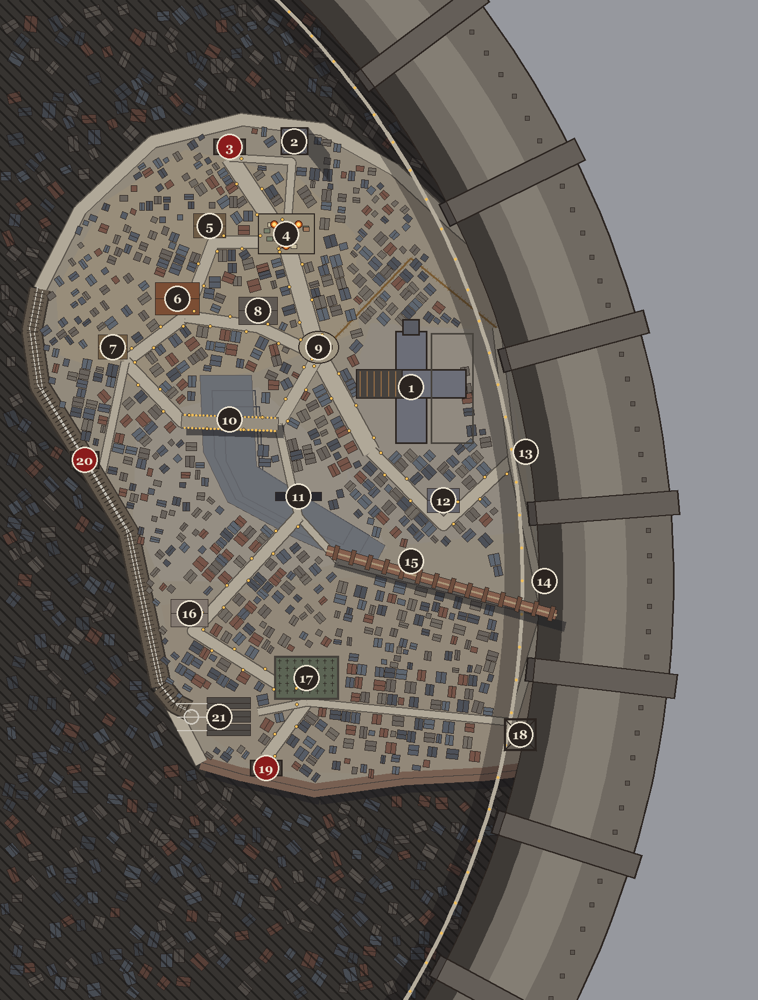
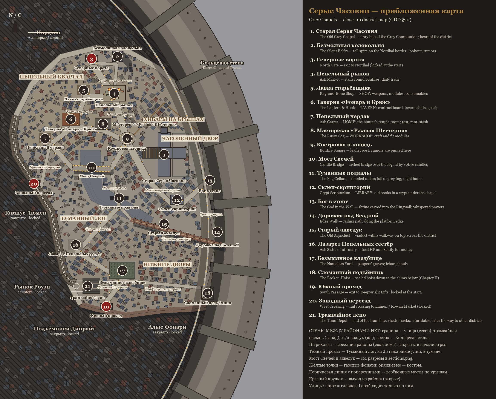
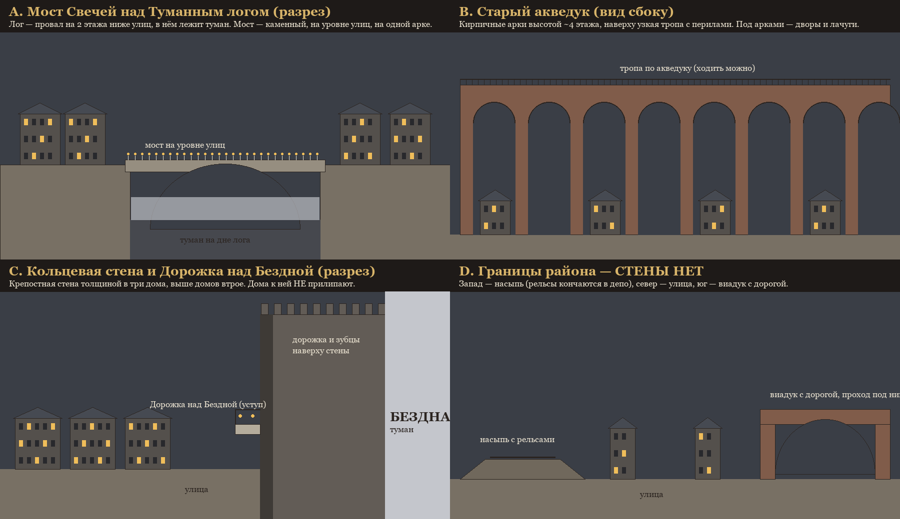
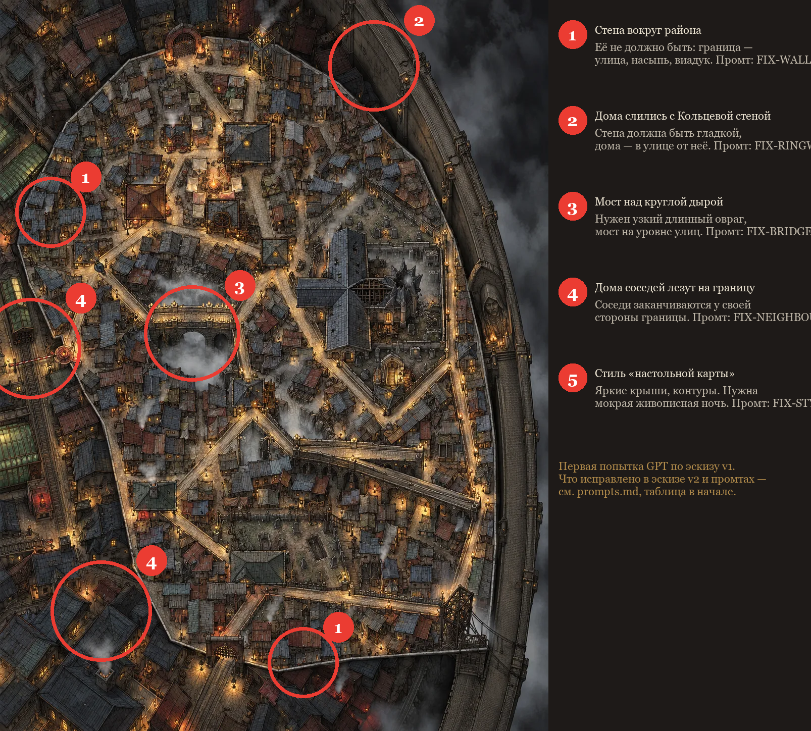

# Карта Серых Часовен (трущобы) — всё для генерации

**Быстрый старт в новом чате — [one-shot.md](one-shot.md).** Ниже — полная версия.

Здесь собрано всё, что нужно, чтобы сгенерировать в ChatGPT приближенную карту района «Серые Часовни»:
пошаговая инструкция, промты, картинки для GPT, подписанные эскизы для тебя и примеры ошибок.
Дизайн района (места, улицы, зоны, как по нему ходит герой) — [GDD §20](../../gdd/20-district-view-grey-chapels.md).

## Что лежит в папке

| Файл | Для кого | Что это |
|---|---|---|
| [one-shot.md](one-shot.md) | GPT | **Всё в одном**: одно сообщение + одна картинка-лист — чтобы запустить в новом чате |
| `for-gpt/reference_sheet.png` | GPT | Лист со всеми эталонами (план, разрезы, город, подъёмник); полная версия с образцами стиля — у тебя в `assets/refs/GREY_reference_sheet_full.png` |
| [atlas.md](atlas.md) | тебе | **Атлас района**: зоны цветом, границы по типам, особые объекты, вырезка каждой зоны и каждого места с описанием |
| [prompts.md](prompts.md) | GPT | Все промты (по-английски): блоки стиля и карты, D0-A, D0-B, FIX-промты, D1 для 12 кусков |
| `for-gpt/plan_clean.png` | GPT | План района: граница, улицы, ряды домов, места под номерами 1–21. **Без слов** |
| `for-gpt/sections_clean.png` | GPT | Разрезы A–D без слов: мост над логом, акведук, Кольцевая стена, границы без стены |
| `for-gpt/location.png` | GPT | Где район на карте города (остальные районы затемнены) |
| `for-gpt/tile_refs/GREY_tile_rXcY_ref.png` | GPT | 12 эталонов для кусков: слева план куска, справа тот же участок на старой карте |
| `for-owner/sketch.png` | тебе | План с русскими подписями мест, зон, улиц и легендой |
| `for-owner/sections.png` | тебе | Разрезы с пояснениями по-русски |
| `for-owner/tiles.png` | тебе | План с сеткой 3 × 4 — какой кусок где |
| `examples/attempt_1.webp` | тебе | Первая попытка GPT (по старому эскизу) |
| `examples/attempt_1_marked.png` | тебе | Та же попытка с отмеченными ошибками и названием FIX-промта для каждой |
| `examples/attempt_2.webp` | тебе | Вторая попытка (D0-A по эскизу v2): форма района правильная |
| `examples/attempt_3.webp` | тебе | Третья (D0-B): места появились; ошибки — рельсы уходят на виадук и становятся дорогой, Кольцевая стена тонкая |
| `examples/approved_18_broken_hoist.png` | GPT | **Одобрен владельцем**: Сломанный подъёмник (18) — прикладывать, чтобы рисовал так же |
| `layout.json` | игре | Контур, места, сеть улиц в пикселях карты — станет игровыми данными |

**Образцы стиля** (3 уличные картинки, которые ты присылал) лежат только у тебя: `assets/refs/STYLE_ref_1.webp`,
`_2`, `_3`. В репозиторий они не кладутся — это чужие работы.

**Не прикладывай к GPT** `for-owner/*` — там русские подписи, GPT начнёт их перерисовывать в картинку.

### Как выглядят

| План для GPT | Эскиз для тебя | Разрезы | Ошибки первой попытки |
|---|---|---|---|
|  |  |  |  |

## Сейчас: что сделать с третьей попыткой

Третья попытка (`examples/attempt_3.webp`) почти готова. В **тот же чат** отправь по очереди **FIX-RAILS** и
**FIX-RINGWALL** из [prompts.md](prompts.md), приложив новые `for-gpt/plan_clean.png` и `for-gpt/sections_clean.png`
(в них уже есть депо и массивная стена) и `examples/approved_18_broken_hoist.png` с припиской «keep the broken hoist
exactly as it is». Остальное не трогать.

## Пошагово

### Шаг 1. Общий вид района — форма (D0-A)

1. Открой **новый чат** в ChatGPT — весь район делается в одном чате.
2. Вставь из [prompts.md](prompts.md): **STYLE BLOCK**, **MAP BLOCK** и текст **D0-A**.
3. Приложи: `for-gpt/plan_clean.png`, `for-gpt/sections_clean.png`, `for-gpt/location.png`,
   `examples/approved_18_broken_hoist.png` и 3 образца стиля из `assets/refs/`.
4. Отправь.

### Шаг 2. Проверка и исправления

Сверь результат с таблицей «After D0-A» в [prompts.md](prompts.md) (и с примером ошибок `examples/attempt_1_marked.png`):

| Если видишь | Отправь в тот же чат |
|---|---|
| стену вокруг района или между районами | FIX-WALL |
| дома на Кольцевой стене / слились с ней / стена тонкая, похожа на дорогу | FIX-RINGWALL |
| рельсы идут дальше по южному виадуку или превращаются в дорогу, нет депо | FIX-RAILS |
| дома соседей лезут через границу, полосы вместо домов | FIX-NEIGHBOURS |
| круглую дыру с мостом, мост в никуда, акведук без арок | FIX-BRIDGES |
| вид наклонён, как с улицы | FIX-CAMERA |
| яркие крыши, контуры, «настольная игра» | FIX-STYLE |

Новый чат не начинай — исправляй в том же.

### Шаг 3. Детали мест (D0-B)

Когда форма правильная — отправь в тот же чат **D0-B**. Он только уточняет здания по номерам, остальное не трогает.

### Шаг 4. Отправь мне

Сохрани результат как `assets/district_maps/GREY__overview.png` и напиши «проверь карту» — субагент
`map-checker` сравнит её с планом и образцами и выдаст готовые FIX-сообщения для ChatGPT.
Быстрая самопроверка внутри самого ChatGPT — в конце [one-shot.md](one-shot.md).

### Шаг 5. Двенадцать кусков (после моей проверки)

1. В том же чате, по порядку: r0c0, r0c1, r0c2, r1c0, r1c1, r1c2, r2c0 … r3c2 (схема — `for-owner/tiles.png`).
2. Для каждого: STYLE BLOCK + MAP BLOCK + **D1**, в `{TILE}` и `{CONTENT}` подставь строку из таблицы в [prompts.md](prompts.md).
3. Приложи: эталон куска из `for-gpt/tile_refs/`, готовый общий вид (шаг 4), образцы стиля и уже готовые куски
   слева и сверху.
4. Для ровного стыка можно попросить у меня заготовку: я запускаю
   `python tools/gen_district_sketch.py --canvas r1c1`, она появится в `assets/district_maps/canvas/` — края
   соседей уже на месте, GPT дорисовывает серую часть.
5. Сохраняй как `assets/district_maps/GREY__map__r1c1.png` (1024 × 1024) — и так для всех 12, затем напиши мне:
   я запущу `python tools/import_art.py` и склею куски.

Кусок r3c0 почти целиком соседние районы (в игре затемнены), в r0c2 и r3c2 много стены и соседей — эти три
делай последними.

### Если куски не стыкуются

Запасной путь (GDD §20.8): одна большая картина (общий вид), увеличенная до размера карты, а крупные здания —
отдельными картинками поверх. Скажи мне, если до этого дойдёт.

## Как обновить картинки в папке

Всё в `for-gpt/`, `for-owner/` и `layout.json` рисует скрипт из данных района (`tools/district_layout_grey.py`):

```bash
python tools/gen_district_sketch.py
```

Руками картинки не правь — изменения пропадут при следующем запуске.
