# Атлас района «Серые Часовни»

Сгенерирован `tools/gen_district_sketch.py` — руками не править. Как генерировать карту — [README.md](README.md),
промты — [prompts.md](prompts.md), дизайн — [GDD §20](../../gdd/20-district-view-grey-chapels.md).

## 1. Весь район

## 2. Зоны (цветом)

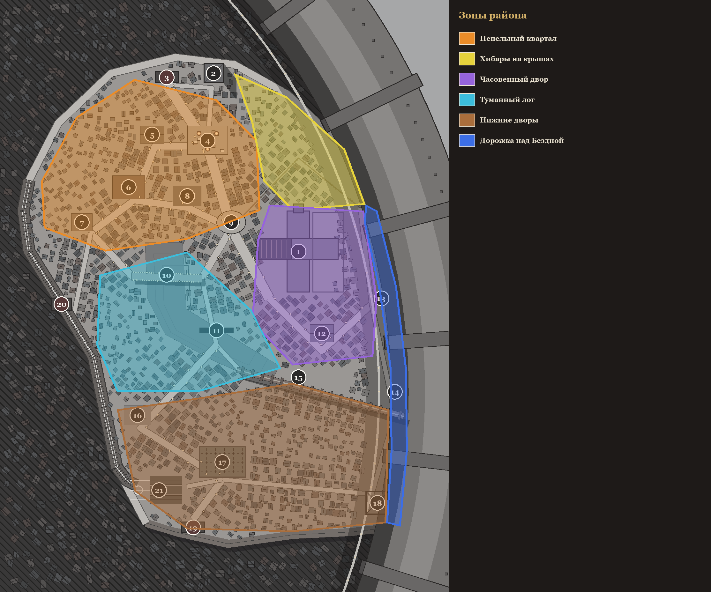

### Пепельный квартал

Сердце жизни охотника: дом, таверна, мастерская, лавка, рынок. Тесные ряды закопчённых доходных домов в 2–3 этажа, бельё между окнами, костры в бочках. Бедно, но живо.

Места: 4. Пепельный рынок, 5. Лавка старьёвщика, 6. Таверна «Фонарь и Крюк», 7. Пепельный чердак, 8. Мастерская «Ржавая Шестерня»

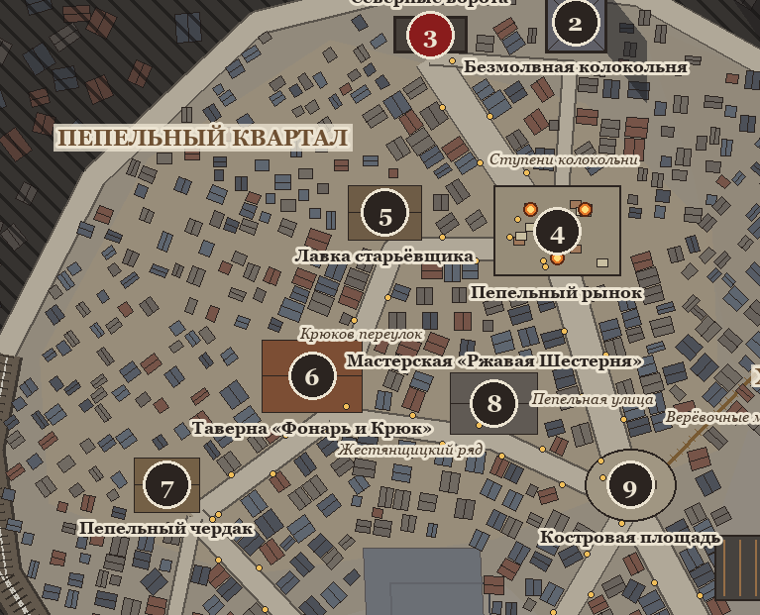

### Хибары на крышах

Хибары, построенные прямо на крышах старых домов; между ними верёвочные мосты и лестницы, голубятни, лес труб. Ветрено и шатко. Здесь видят тени на крышах.

Места: —

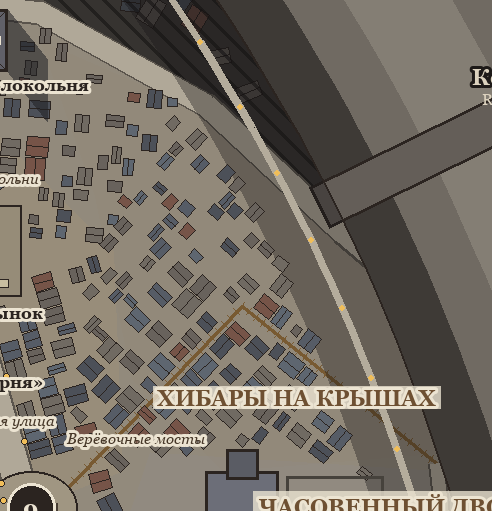

### Часовенный двор

Разрушенная Старая Серая Часовня и её обнесённый стеной двор: поваленные святые, серые свечи, меловые знаки культа. Свято и неправильно. Тайный центр Серого Причастия.

Места: 1. Старая Серая Часовня, 12. Склеп-скрипторий

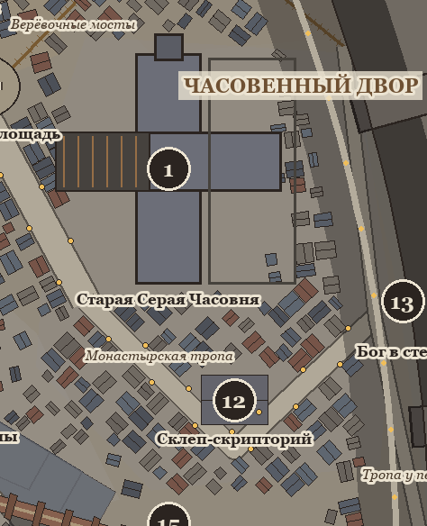

### Туманный лог

Провал, где платформа просела: узкий овраг на два этажа ниже улиц, в нём лежит туман, как вода. Затопленные подвалы. Над ним — Мост Свечей. Холодно и тихо.

Места: 10. Мост Свечей, 11. Туманные подвалы

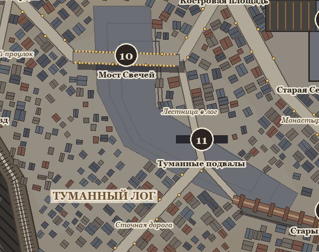

### Нижние дворы

Дворы, сараи и лачуги вдоль акведука до южного края; кладбище бедняков, лазарет, трамвайное депо. Заброшенно и голодно.

Места: 16. Лазарет Пепельных сестёр, 17. Безымянное кладбище, 18. Сломанный подъёмник, 19. Южный проход, 21. Трамвайное депо

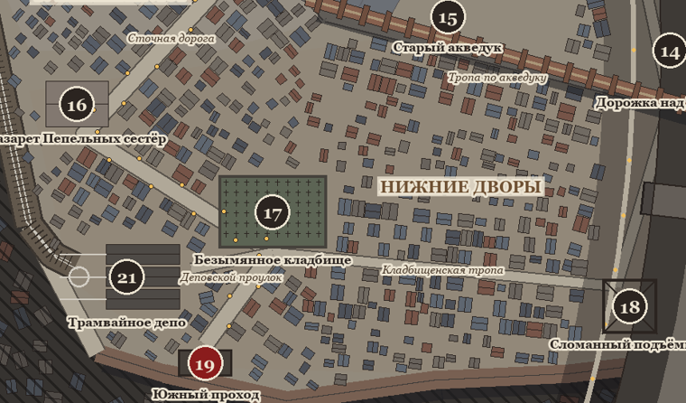

### Дорожка над Бездной

Узкая дорожка с перилами у подножия Кольцевой стены, фонари на цепях, в тени стены. Головокружительно.

Места: 13. Бог в стене, 14. Дорожка над Бездной

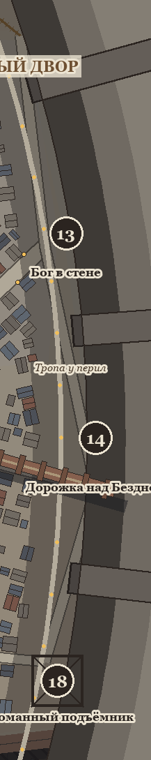

## 3. Границы — стены между районами нет

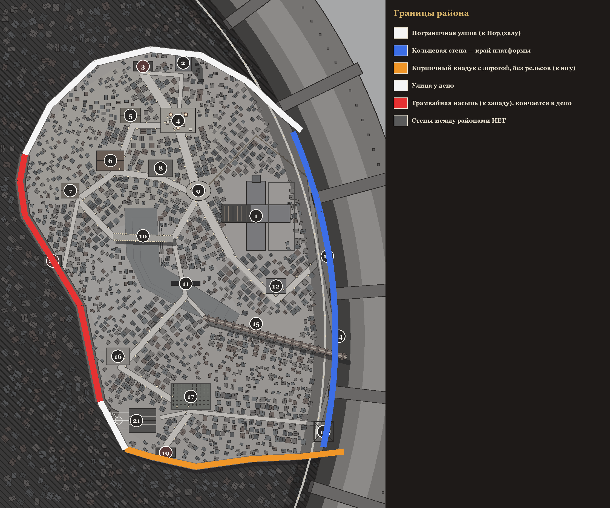

## 4. Особые объекты и высоты

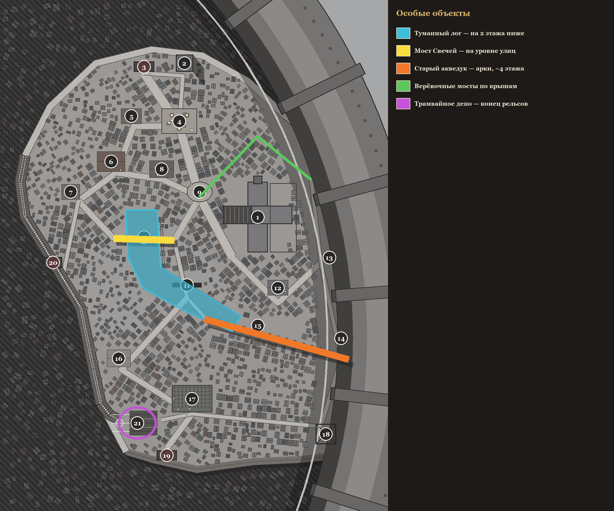

Разрезы (вид сбоку):

## 5. Все места

| № | Место | Что это в игре | Вид на плане |
|---|---|---|---|
| 1 | **Старая Серая Часовня** The Old Grey Chapel | Сюжетный центр Серого Причастия, первый сюжетный заказ | 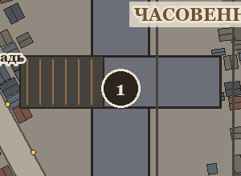 |
| 2 | **Безмолвная колокольня** The Silent Belfry | Высокая колокольня без колокола: смотровая точка, слухи рядом | 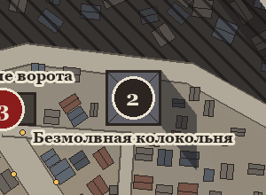 |
| 3 | **Северные ворота** North Gate | Выход в Нордхал — закрыт в начале | 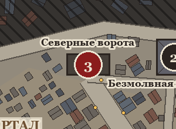 |
| 4 | **Пепельный рынок** Ash Market | Ежедневная торговля, еда, сплетни | 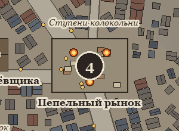 |
| 5 | **Лавка старьёвщика** Rag-and-Bone Shop | ЛАВКА: оружие, модули, расходники | 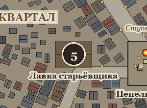 |
| 6 | **Таверна «Фонарь и Крюк»** The Lantern & Hook | ТАВЕРНА: доска заказов, подработка, сплетни | 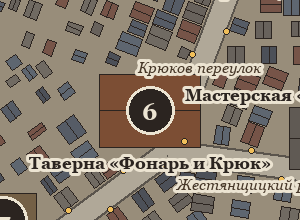 |
| 7 | **Пепельный чердак** Ash Garret | ДОМ: отдых, аренда, тайник; отсюда начинается игра | 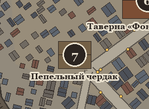 |
| 8 | **Мастерская «Ржавая Шестерня»** The Rusty Cog | МАСТЕРСКАЯ: изготовление и установка модулей | 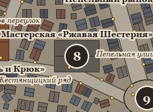 |
| 9 | **Костровая площадь** Bonfire Square | Столб листовок — здесь вывешивают слухи | 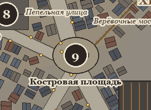 |
| 10 | **Мост Свечей** Candle Bridge | Каменный мост над логом, свечи по парапетам | 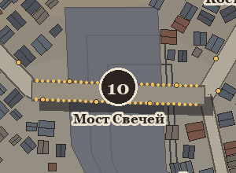 |
| 11 | **Туманные подвалы** The Fog Cellars | Ночные охоты, туманные твари, тайные комнаты культа | 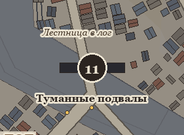 |
| 12 | **Склеп-скрипторий** Crypt Scriptorium | БИБЛИОТЕКА: изучение тварей, старые книги | 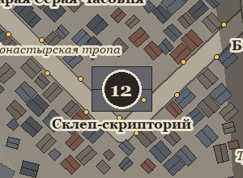 |
| 13 | **Бог в стене** The God in the Wall | Святилище запретной веры в Кольцевой стене | 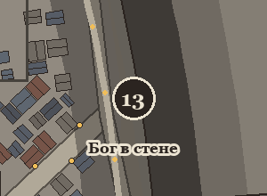 |
| 14 | **Дорожка над Бездной** Edge Walk | Дорожка у стены, редкие события | 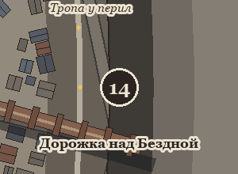 |
| 15 | **Старый акведук** The Old Aqueduct | Кирпичный акведук на арках, по верху можно ходить | 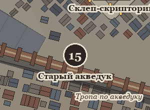 |
| 16 | **Лазарет Пепельных сестёр** Ash Sisters' Infirmary | Лечение здоровья и рассудка за деньги | 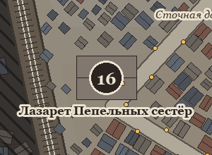 |
| 17 | **Безымянное кладбище** The Nameless Yard | Кладбище бедняков: ихор, заказы на гулей | 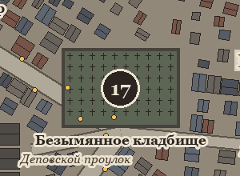 |
| 18 | **Сломанный подъёмник** The Broken Hoist | Запечатанный спуск в нижние трущобы (глава II) | 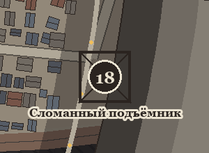 |
| 19 | **Южный проход** South Passage | Выход к Подъёмникам Дипрайт — закрыт | 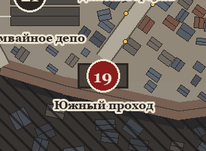 |
| 20 | **Западный переезд** West Crossing | Переезд к Люмену и Рынку Роуэн — закрыт | 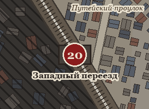 |
| 21 | **Трамвайное депо** The Tram Depot | Конец трамвайной линии; позже — путь в другие районы | 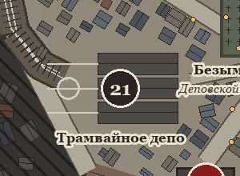 |

## 6. Сетка кусков для генерации

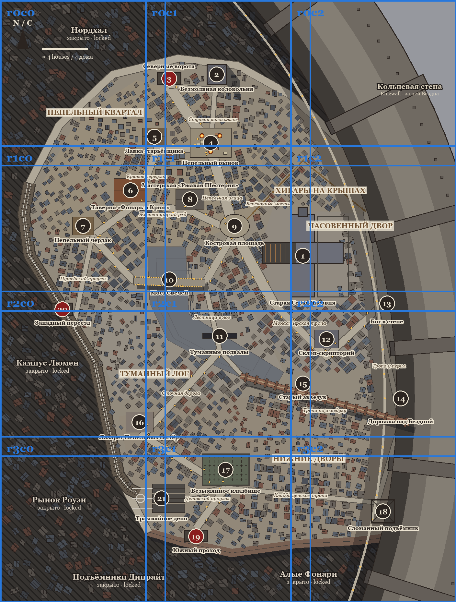

## 7. Одобренные образцы

Сломанный подъёмник (18) — таким и оставить:

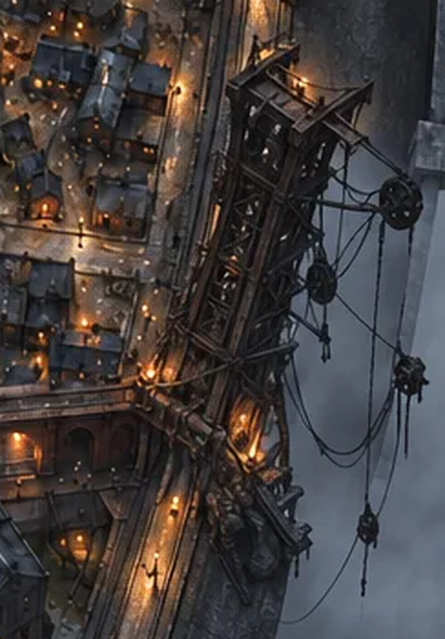
