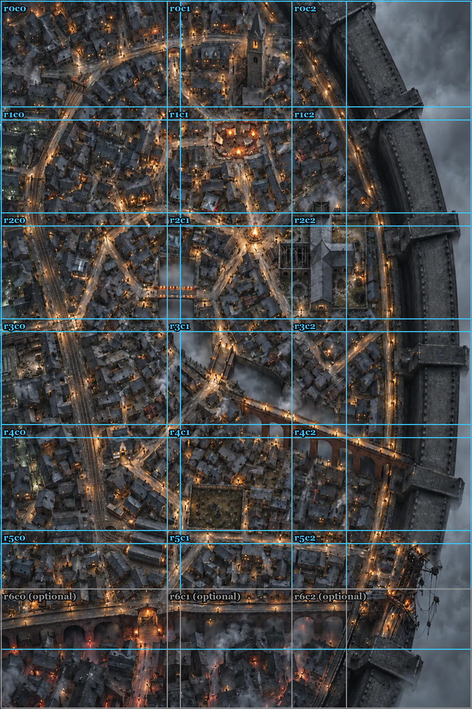

# Игровая карта Серых Часовен — детализация кусками

> **Готово (2026-10-10):** все 21 кусок нарисованы (включая необязательные r6), северная стена исправлена, карта
> собрана в `art/city/district_maps/GREY__map.webp`. Перерисовать кусок — по шагам ниже, импорт пересоберёт карту.

Общий вид района готов (`assets/district_maps/GREY__overview.png`, в игре — `art/city/district_maps/GREY__overview.webp`).
Теперь из него делается **игровая карта** в 3 раза крупнее — **4000 × 6000**: дом около 80 пикселей, на экран
1920 × 1080 помещается примерно половина ширины района, остальное смотрится перетаскиванием (зажатая левая кнопка).

ChatGPT рисует не больше 1536 × 1024 за раз, поэтому карта перерисовывается **кусками 1536 × 1024** с перекрытием
128 px. Каждый кусок — это **тот же участок общего вида**, только с деталями: все здания, улицы, мосты, стена остаются
**ровно на своих местах**.

## Сетка



**21 кусок: 7 рядов × 3 колонки** (r0c0 … r6c2). Серые r6c0, r6c1, r6c2 — необязательные (почти только соседи
за виадуком, в игре затемнены). Обязательных — 18.

**Если какого-то куска нет** (удалён или перерисовывается), импорт ставит на его место увеличенный общий вид
(размытый, но на своём месте) — карта всегда целая.

## Как делать один кусок

1. Чат: **новый** или тот же, где делался общий вид. Модель — ChatGPT Images 2.0, режим **Thinking**, усилие
   максимальное.
2. Приложи:
   - `refs/GREY_detail_r{R}c{C}_ref.jpg` — эталон этого куска (увеличенный участок общего вида);
   - если соседний кусок **слева или сверху уже готов** — вместо эталона попроси у меня заготовку стыка
     (`python tools/district_detail_tiles.py --canvas r{R}c{C}`, файл появится в `assets/district_maps/canvas/`):
     в ней края готовых соседей уже вставлены;
   - для стиля — твои образцы `assets/refs/STYLE_ref_1..3.webp` (в первом сообщении чата достаточно один раз).
3. Отправь сообщение ниже, подставив номер куска.
4. Сохрани результат как `assets/district_maps/GREY__detail__r{R}c{C}.png` и напиши мне «проверь кусок r{R}c{C}».
   Проверяющий наложит кусок на эталон 50/50 — сдвинутое здание видно двойным контуром.
5. Когда кусок принят, я запускаю импорт — он вклеивает кусок в игровую карту с мягким стыком.

Порядок: **ряд за рядом слева направо** (r0c0, r0c1, r0c2, r1c0 …) — тогда у каждого куска готовы сосед слева и сверху.

## Сообщение для ChatGPT (одно на каждый кусок)

```text
This is piece {R}{C} (for example r2c1) of a large top-down game map, 1536x1024, landscape.
The attached image is the exact reference for this piece: an enlarged crop of the approved overview map.
Repaint it as a 1536x1024 image at much finer detail, as if the camera came three times closer.

KEEP EXACTLY (most important): every building, roof shape, street, square, bridge, stair, wall, tower, tree,
fire and lamp stays in the same place, the same size and the same shape as in the reference. Do not move,
add, remove or merge buildings. Do not straighten or reroute streets. The same camera angle (straight down,
very slight perspective), the same light direction, the same night palette and the same fog.

ADD ONLY DETAIL: individual slate and tin roof tiles, patches and planks, chimneys with smoke, skylights, lit
and dark windows, gutters, washing lines, cobblestones, wet puddles reflecting lamps, gas lamp posts, barrels,
crates, carts, small market stalls, chalk signs, moss and grime; people only as tiny dark figures.

STYLE: realistic painterly concept art of a Victorian slum at night after rain, desaturated cold greys and soot
black with small warm amber lights, like the attached style references (use them only for colour, rain and light,
not for the camera). No text, no letters, no numbers, no frame.

If the attached image has sharp painted strips along its left or top edge (finished neighbour pieces), keep
those strips exactly as they are and continue roofs and streets across them seamlessly.
```

## Если что-то не так

| Если видишь | Отправь в тот же чат |
|---|---|
| Здания сдвинулись, появились новые, улица пошла иначе | `You changed the layout. Redo it so that every building and street is exactly where it is in the reference — same positions, sizes and shapes. Only add detail.` |
| Мало деталей, просто резче | `Add much more fine detail at roof and street level (roof tiles, chimneys, windows, cobbles, puddles, lamps, small props), as if the camera came three times closer. Keep every position exactly.` |
| Другой свет или цвета, чем на общем виде | `Match the light and colours of the reference exactly: cold desaturated night, small warm amber lamps, the same fog. Keep everything else.` |
| Стык с соседом не совпадает | `Keep the left and top strips exactly as in the attached canvas and continue the roofs and streets across them without a visible seam.` |
| Появился текст или рамка | `Remove all text, letters, numbers and frames. Keep everything else exactly the same.` |
