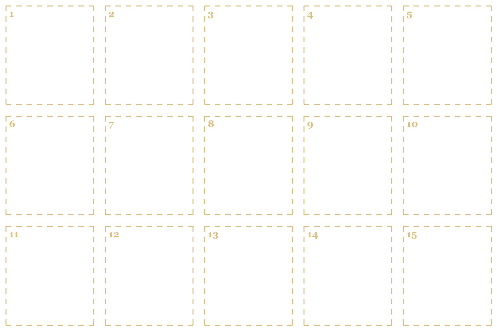

# D. Game Icons

Every icon of the game: **169 icons in 25 sets**, catalog `data/ui/icons.json`.

## One image per set

- Every set is generated as **ONE image** with all its icons on a grid — never icon by icon.
- Grid per set: up to 5 icons → one row, up to 10 → two rows, up to 15 → three rows. Attach the set's layout guide `docs/assets/templates/icons/<SET>__grid.png` (numbered slots).
- Save as `assets/icons/<SET>__sheet.png`; the import cuts it into `art/ui/icons/<SET>__<id>.webp` (each piece goes to the slot of its centre, so drips and sparks stay with their icon).
- One bad icon → regenerate the whole set, attaching the previous image and asking to change only that icon.



## Styles

| Style | Used for | Size in game |
|---|---|---|
| Object | Resources, weapon sections, armor, day actions | 64–256 px |
| Symbol | Stats, statuses, intents, card types, tags, outcomes, UI — must read at 32 px | 24–96 px |
| Crest | Factions and districts | 48–256 px |
| Badge | Register ranks A / P / D / S (letter added by the game) | 32–96 px |

```text
ICON STYLE — OBJECT:
A painted game icon of an object, slight 3/4 view, thick dark ink outline,
painted metal / leather / wood / glass with wear, warm light from the top-left —
exactly the look of the attached resource icons. Readable at 64 px.
```

```text
ICON STYLE — SYMBOL:
A small game symbol icon that must read at 32 px: one simple bold shape,
cast in dark tarnished brass like a token or engraved badge, thick dark outline,
minimal inner detail, strong silhouette. Palette: brass, soot black, parchment,
plus ONE accent colour only where it carries meaning (blood red, cold blue, sickly green, violet).
```

```text
ICON STYLE — CREST:
A heraldic emblem: a bold central symbol pressed into an aged round wax seal or painted on a
small chipped iron shield. Readable at 64 px, no lettering, no banners with words.
```

```text
ICON STYLE — BADGE:
A blank metal rank badge with an EMPTY, smooth centre (the game prints a letter there).
Front view, thick dark outline, aged metal. No letters, no numbers.
```

## Sets

| Set | Icons | Grid | Style | File |
|---|---|---|---|---|
| RESOURCE | 6 | 3 × 2 | Object icon | `RESOURCE__sheet.png` |
| STAT | 8 | 4 × 2 | Symbol icon | `STAT__sheet.png` |
| ATTRIBUTE | 3 | 3 × 1 | Symbol icon | `ATTRIBUTE__sheet.png` |
| STATUS | 6 | 3 × 2 | Symbol icon | `STATUS__sheet.png` |
| INTENT | 7 | 4 × 2 | Symbol icon | `INTENT__sheet.png` |
| CARD_TYPE | 6 | 3 × 2 | Symbol icon | `CARD_TYPE__sheet.png` |
| CELL | 3 | 3 × 1 | Symbol icon | `CELL__sheet.png` |
| SECTION | 5 | 5 × 1 | Object icon | `SECTION__sheet.png` |
| ARMOR | 5 | 5 × 1 | Object icon | `ARMOR__sheet.png` |
| SKILL | 6 | 3 × 2 | Symbol icon | `SKILL__sheet.png` |
| DIRECTION | 4 | 4 × 1 | Symbol icon | `DIRECTION__sheet.png` |
| CONTRACT | 6 | 3 × 2 | Symbol icon | `CONTRACT__sheet.png` |
| OUTCOME | 5 | 5 × 1 | Symbol icon | `OUTCOME__sheet.png` |
| TAG | 6 | 3 × 2 | Symbol icon | `TAG__sheet.png` |
| ACTION | 8 | 4 × 2 | Object icon | `ACTION__sheet.png` |
| FACTION | 15 | 5 × 3 | Crest | `FACTION__sheet.png` |
| RANK | 4 | 4 × 1 | Badge | `RANK__sheet.png` |
| REPUTATION | 5 | 5 × 1 | Symbol icon | `REPUTATION__sheet.png` |
| STATE | 13 | 5 × 3 | Symbol icon | `STATE__sheet.png` |
| DISTRICT | 12 | 4 × 3 | Crest | `DISTRICT__sheet.png` |
| KNOWLEDGE | 5 | 5 × 1 | Symbol icon | `KNOWLEDGE__sheet.png` |
| UI | 14 | 5 × 3 | Symbol icon | `UI__sheet.png` |
| PLACE | 8 | 4 × 2 | Object icon | `PLACE__sheet.png` |
| MECHANISM | 4 | 4 × 1 | Object icon | `MECHANISM__sheet.png` |
| SETTINGS | 5 | 5 × 1 | Symbol icon | `SETTINGS__sheet.png` |

### RESOURCE — 6 icons · grid 3×2 · Object icon · DONE

Resources (GDD 6.1). Already generated — keep for re-generation.

| # | File | Name | Where it is used | Look |
|---|---|---|---|---|
| 1 | `RESOURCE__gears` | Gears | Resource counter, shop, crafting costs | a single worn brass cogwheel with rivets |
| 2 | `RESOURCE__scrap` | Work scrap | Resource counter, shop, crafting costs | a small pile of rusty pipes, nuts and bent plates |
| 3 | `RESOURCE__electronics` | Electronics | Resource counter, shop, crafting costs | a small brass-framed circuit board with two glass capacitors |
| 4 | `RESOURCE__ichor` | Ichor | Resource counter, Monster web, blood modules | a glossy drop of dark red blood with small drips |
| 5 | `RESOURCE__trophy` | Trophies | Loot from broken body parts | a long bloody fang or claw with a torn root |
| 6 | `RESOURCE__money` | Money | Money counter, rewards, prices | a gold coin with a laurelled profile |

```text
[STYLE BLOCK]
[ICON STYLE — OBJECT]
Attached: RESOURCE icons (style reference), RESOURCE__grid.png (layout guide).
ONE image with ALL 6 icons of this set: Resources (GDD 6.1). Already generated — keep for re-generation.
Lay them out as a grid of 3 columns × 2 rows, exactly like the attached layout guide:
each icon centred in its own slot, all the same size and style, clear empty space between
them (they must not touch). Order: left to right, top to bottom.
Row 1:
  1. Gears — a single worn brass cogwheel with rivets
  2. Work scrap — a small pile of rusty pipes, nuts and bent plates
  3. Electronics — a small brass-framed circuit board with two glass capacitors
Row 2:
  4. Ichor — a glossy drop of dark red blood with small drips
  5. Trophies — a long bloody fang or claw with a torn root
  6. Money — a gold coin with a laurelled profile
Transparent background. Do not draw the guide lines or slot numbers.
No text, no labels, no numbers, no frames or circles around the icons.
Output: transparent PNG, 3:2 landscape (1536×1024). Save as RESOURCE__sheet.png.
```

### STAT — 8 icons · grid 4×2 · Symbol icon

The hunter's counters on the left edge of the combat screen and in menus (GDD 4.2).

| # | File | Name | Where it is used | Look |
|---|---|---|---|---|
| 1 | `STAT__hp` | Health | HP counter | an anatomical heart wrapped in a brass band |
| 2 | `STAT__sanity` | Sanity | Sanity counter, Fear damage | an open eye inside a cracked glass circle |
| 3 | `STAT__ap` | Action points | AP counter, card cost | a brass hourglass-shaped token with three notches |
| 4 | `STAT__block` | Block | Block value on hunter and creature | a round riveted iron buckler |
| 5 | `STAT__ammo` | Ammo | Weapon card, ammo cost on cards | a single brass rifle cartridge standing upright |
| 6 | `STAT__voice` | The Voice | Corruption meter, Monster web | a bloody mouth with fangs inside a ring of sound waves |
| 7 | `STAT__xp` | Experience | Level bar | a hunter's mark: crossed knife and quill over a small skull |
| 8 | `STAT__skill_point` | Skill point | Skill web, level up | a glowing brass rivet shaped like a star node of a web |

```text
[STYLE BLOCK]
[ICON STYLE — SYMBOL]
Attached: RESOURCE icons (style reference), STAT__grid.png (layout guide).
ONE image with ALL 8 icons of this set: The hunter's counters on the left edge of the combat screen and in menus (GDD 4.2).
Lay them out as a grid of 4 columns × 2 rows, exactly like the attached layout guide:
each icon centred in its own slot, all the same size and style, clear empty space between
them (they must not touch). Order: left to right, top to bottom.
Row 1:
  1. Health — an anatomical heart wrapped in a brass band
  2. Sanity — an open eye inside a cracked glass circle
  3. Action points — a brass hourglass-shaped token with three notches
  4. Block — a round riveted iron buckler
Row 2:
  5. Ammo — a single brass rifle cartridge standing upright
  6. The Voice — a bloody mouth with fangs inside a ring of sound waves
  7. Experience — a hunter's mark: crossed knife and quill over a small skull
  8. Skill point — a glowing brass rivet shaped like a star node of a web
Accents: health = blood red, sanity = violet, voice = dark red, all others brass only.
Transparent background. Do not draw the guide lines or slot numbers.
No text, no labels, no numbers, no frames or circles around the icons.
Output: transparent PNG, 3:2 landscape (1536×1024). Save as STAT__sheet.png.
```

### ATTRIBUTE — 3 icons · grid 3×1 · Symbol icon

Will, Agility, Cunning (GDD 4.1).

| # | File | Name | Where it is used | Look |
|---|---|---|---|---|
| 1 | `ATTRIBUTE__will` | Will | Character sheet, checks | a clenched gauntlet fist holding a candle flame |
| 2 | `ATTRIBUTE__agility` | Agility | Character sheet, checks | a feathered boot heel with motion lines of ink |
| 3 | `ATTRIBUTE__cunning` | Cunning | Character sheet, checks | a fox mask with one narrowed eye |

```text
[STYLE BLOCK]
[ICON STYLE — SYMBOL]
Attached: RESOURCE icons (style reference), ATTRIBUTE__grid.png (layout guide).
ONE image with ALL 3 icons of this set: Will, Agility, Cunning (GDD 4.1).
Lay them out as a grid of 3 columns × 1 row, exactly like the attached layout guide:
each icon centred in its own slot, all the same size and style, clear empty space between
them (they must not touch). Order: left to right, top to bottom.
Row 1:
  1. Will — a clenched gauntlet fist holding a candle flame
  2. Agility — a feathered boot heel with motion lines of ink
  3. Cunning — a fox mask with one narrowed eye
Transparent background. Do not draw the guide lines or slot numbers.
No text, no labels, no numbers, no frames or circles around the icons.
Output: transparent PNG, 3:2 landscape (1536×1024). Save as ATTRIBUTE__sheet.png.
```

### STATUS — 6 icons · grid 3×2 · Symbol icon

Statuses on the hunter and the creature (GDD 9, combat rules).

| # | File | Name | Where it is used | Look |
|---|---|---|---|---|
| 1 | `STATUS__weak` | Weak | Status: deals less damage | a broken sword blade drooping down |
| 2 | `STATUS__exposed` | Exposed | Status: takes more damage | a cracked breastplate with a gap |
| 3 | `STATUS__bleed` | Bleed | Status: loses HP each turn | three falling blood drops |
| 4 | `STATUS__dodge` | Dodge | Status: avoids the next attack | a swirl of grey smoke with a silhouette slipping away |
| 5 | `STATUS__enraged` | Enraged | Status: deals more damage | a red burning eye with a vertical pupil |
| 6 | `STATUS__panic` | Panic | Hunter at 0 Sanity | a trembling hand with spilled ink around it |

```text
[STYLE BLOCK]
[ICON STYLE — SYMBOL]
Attached: RESOURCE icons (style reference), STATUS__grid.png (layout guide).
ONE image with ALL 6 icons of this set: Statuses on the hunter and the creature (GDD 9, combat rules).
Lay them out as a grid of 3 columns × 2 rows, exactly like the attached layout guide:
each icon centred in its own slot, all the same size and style, clear empty space between
them (they must not touch). Order: left to right, top to bottom.
Row 1:
  1. Weak — a broken sword blade drooping down
  2. Exposed — a cracked breastplate with a gap
  3. Bleed — three falling blood drops
Row 2:
  4. Dodge — a swirl of grey smoke with a silhouette slipping away
  5. Enraged — a red burning eye with a vertical pupil
  6. Panic — a trembling hand with spilled ink around it
Accents: weak = ochre, exposed = steel blue, bleed = blood red, dodge = fog grey, enraged = red-orange, panic = violet.
Transparent background. Do not draw the guide lines or slot numbers.
No text, no labels, no numbers, no frames or circles around the icons.
Output: transparent PNG, 3:2 landscape (1536×1024). Save as STATUS__sheet.png.
```

### INTENT — 7 icons · grid 4×2 · Symbol icon

Icons on the creature's intent cards (GDD 9.4).

| # | File | Name | Where it is used | Look |
|---|---|---|---|---|
| 1 | `INTENT__attack` | Attack | Intent: the creature will strike | three claw slashes |
| 2 | `INTENT__defend` | Defend | Intent: the creature will block | a chitin carapace shell |
| 3 | `INTENT__fear` | Fear | Intent: Sanity damage | a tentacled shadow over a small eye |
| 4 | `INTENT__debuff` | Debuff | Intent: weakens the hunter | a wilted thorn branch dripping black |
| 5 | `INTENT__buff` | Buff | Intent: strengthens itself | a rising red flame with fangs |
| 6 | `INTENT__heal` | Heal | Intent: heals itself | stitched flesh with a sewing needle |
| 7 | `INTENT__unknown` | Unknown | Intent hidden or cancelled | a black question-shaped smoke curl |

```text
[STYLE BLOCK]
[ICON STYLE — SYMBOL]
Attached: RESOURCE icons (style reference), INTENT__grid.png (layout guide).
ONE image with ALL 7 icons of this set: Icons on the creature's intent cards (GDD 9.4).
Lay them out as a grid of 4 columns × 2 rows, exactly like the attached layout guide:
each icon centred in its own slot, all the same size and style, clear empty space between
them (they must not touch). Order: left to right, top to bottom.
Row 1:
  1. Attack — three claw slashes
  2. Defend — a chitin carapace shell
  3. Fear — a tentacled shadow over a small eye
  4. Debuff — a wilted thorn branch dripping black
Row 2:
  5. Buff — a rising red flame with fangs
  6. Heal — stitched flesh with a sewing needle
  7. Unknown — a black question-shaped smoke curl
Leave the last 1 slot empty.
Accents (match the intent card borders): attack = red #B03A2E, defend = steel #6E7A8A, fear = violet #6B4A8A, debuff = ochre #8A7A3A, buff = orange #A05A2A, heal = green #4F7A4A, unknown = grey.
Transparent background. Do not draw the guide lines or slot numbers.
No text, no labels, no numbers, no frames or circles around the icons.
Output: transparent PNG, 3:2 landscape (1536×1024). Save as INTENT__sheet.png.
```

### CARD_TYPE — 6 icons · grid 3×2 · Symbol icon

Small badge in the corner of every card (GDD 9.3).

| # | File | Name | Where it is used | Look |
|---|---|---|---|---|
| 1 | `CARD_TYPE__attack` | Attack | Card type badge | a hunting knife crossed with a rifle |
| 2 | `CARD_TYPE__support` | Support | Card type badge | a brass gear with a small shield |
| 3 | `CARD_TYPE__consumable` | Consumable | Card type badge | a corked glass vial |
| 4 | `CARD_TYPE__capture` | Capture | Card type badge | a folded iron net with lead weights |
| 5 | `CARD_TYPE__rage` | Rage | Card type badge | a bloody fist |
| 6 | `CARD_TYPE__curse` | Curse | Card type badge | a black thorned seal |

```text
[STYLE BLOCK]
[ICON STYLE — SYMBOL]
Attached: RESOURCE icons (style reference), CARD_TYPE__grid.png (layout guide).
ONE image with ALL 6 icons of this set: Small badge in the corner of every card (GDD 9.3).
Lay them out as a grid of 3 columns × 2 rows, exactly like the attached layout guide:
each icon centred in its own slot, all the same size and style, clear empty space between
them (they must not touch). Order: left to right, top to bottom.
Row 1:
  1. Attack — a hunting knife crossed with a rifle
  2. Support — a brass gear with a small shield
  3. Consumable — a corked glass vial
Row 2:
  4. Capture — a folded iron net with lead weights
  5. Rage — a bloody fist
  6. Curse — a black thorned seal
Transparent background. Do not draw the guide lines or slot numbers.
No text, no labels, no numbers, no frames or circles around the icons.
Output: transparent PNG, 3:2 landscape (1536×1024). Save as CARD_TYPE__sheet.png.
```

### CELL — 3 icons · grid 3×1 · Symbol icon

Cell types of the weapon grid and armor sockets (GDD 5.2).

| # | File | Name | Where it is used | Look |
|---|---|---|---|---|
| 1 | `CELL__gear` | Gear cell | Weapon grid, module cards | a brass square socket with a cog engraved |
| 2 | `CELL__spark` | Spark cell | Weapon grid, module cards | a copper square socket with a blue lightning sign |
| 3 | `CELL__blood` | Blood cell | Weapon grid, module cards | a bone square socket with a red drop inside |

```text
[STYLE BLOCK]
[ICON STYLE — SYMBOL]
Attached: RESOURCE icons (style reference), CELL__grid.png (layout guide).
ONE image with ALL 3 icons of this set: Cell types of the weapon grid and armor sockets (GDD 5.2).
Lay them out as a grid of 3 columns × 1 row, exactly like the attached layout guide:
each icon centred in its own slot, all the same size and style, clear empty space between
them (they must not touch). Order: left to right, top to bottom.
Row 1:
  1. Gear cell — a brass square socket with a cog engraved
  2. Spark cell — a copper square socket with a blue lightning sign
  3. Blood cell — a bone square socket with a red drop inside
Accents: gear = warm brass, spark = cold blue glow, blood = dark red.
Transparent background. Do not draw the guide lines or slot numbers.
No text, no labels, no numbers, no frames or circles around the icons.
Output: transparent PNG, 3:2 landscape (1536×1024). Save as CELL__sheet.png.
```

### SECTION — 5 icons · grid 5×1 · Object icon

The five sections of a weapon (GDD 5.2).

| # | File | Name | Where it is used | Look |
|---|---|---|---|---|
| 1 | `SECTION__sight` | Sight | Weapon tablet labels, module filters | a brass rifle scope |
| 2 | `SECTION__magazine` | Magazine | Weapon tablet labels, module filters | a box magazine with cartridges |
| 3 | `SECTION__stock` | Stock | Weapon tablet labels, module filters | a wooden rifle stock with a brass butt plate |
| 4 | `SECTION__frame` | Frame | Weapon tablet labels, module filters | a riveted steel rifle receiver |
| 5 | `SECTION__barrel` | Barrel | Weapon tablet labels, module filters | a short rifle barrel with a muzzle brake |

```text
[STYLE BLOCK]
[ICON STYLE — OBJECT]
Attached: RESOURCE icons (style reference), SECTION__grid.png (layout guide).
ONE image with ALL 5 icons of this set: The five sections of a weapon (GDD 5.2).
Lay them out as a grid of 5 columns × 1 row, exactly like the attached layout guide:
each icon centred in its own slot, all the same size and style, clear empty space between
them (they must not touch). Order: left to right, top to bottom.
Row 1:
  1. Sight — a brass rifle scope
  2. Magazine — a box magazine with cartridges
  3. Stock — a wooden rifle stock with a brass butt plate
  4. Frame — a riveted steel rifle receiver
  5. Barrel — a short rifle barrel with a muzzle brake
Transparent background. Do not draw the guide lines or slot numbers.
No text, no labels, no numbers, no frames or circles around the icons.
Output: transparent PNG, 3:2 landscape (1536×1024). Save as SECTION__sheet.png.
```

### ARMOR — 5 icons · grid 5×1 · Object icon

Armor pieces and the mechanism socket (GDD 5.1).

| # | File | Name | Where it is used | Look |
|---|---|---|---|---|
| 1 | `ARMOR__helmet` | Helmet | Equipment screen, Equipment web | a hunter's wide-brimmed hat with a steel plague-mask visor |
| 2 | `ARMOR__chestplate` | Chestplate | Equipment screen, Equipment web | a leather coat with a riveted steel chestplate |
| 3 | `ARMOR__gauntlets` | Gauntlets & Pauldrons | Equipment screen, Equipment web | a steel gauntlet with a shoulder pauldron |
| 4 | `ARMOR__greaves` | Greaves | Equipment screen, Equipment web | tall buckled boots with steel shin plates |
| 5 | `ARMOR__mechanism_socket` | Mechanism socket | Empty socket on armor | a round empty brass socket with screw holes |

```text
[STYLE BLOCK]
[ICON STYLE — OBJECT]
Attached: RESOURCE icons (style reference), ARMOR__grid.png (layout guide).
ONE image with ALL 5 icons of this set: Armor pieces and the mechanism socket (GDD 5.1).
Lay them out as a grid of 5 columns × 1 row, exactly like the attached layout guide:
each icon centred in its own slot, all the same size and style, clear empty space between
them (they must not touch). Order: left to right, top to bottom.
Row 1:
  1. Helmet — a hunter's wide-brimmed hat with a steel plague-mask visor
  2. Chestplate — a leather coat with a riveted steel chestplate
  3. Gauntlets & Pauldrons — a steel gauntlet with a shoulder pauldron
  4. Greaves — tall buckled boots with steel shin plates
  5. Mechanism socket — a round empty brass socket with screw holes
Transparent background. Do not draw the guide lines or slot numbers.
No text, no labels, no numbers, no frames or circles around the icons.
Output: transparent PNG, 3:2 landscape (1536×1024). Save as ARMOR__sheet.png.
```

### SKILL — 6 icons · grid 3×2 · Symbol icon

Skill webs and node types (GDD 4.4).

| # | File | Name | Where it is used | Look |
|---|---|---|---|---|
| 1 | `SKILL__mechanic` | The Mechanic | Web emblem | a cogwheel inside a spider web made of wire |
| 2 | `SKILL__monster` | The Monster | Web emblem | a fanged maw inside a spider web made of veins |
| 3 | `SKILL__passive` | Passive node | Skill node | a small round brass rivet |
| 4 | `SKILL__blueprint` | Blueprint node | Skill node | a rolled blueprint with a wax seal |
| 5 | `SKILL__socket` | Socket node | Skill node | an empty round socket |
| 6 | `SKILL__keystone` | Keystone node | Skill node | an ornate brass key head with a red gem |

```text
[STYLE BLOCK]
[ICON STYLE — SYMBOL]
Attached: RESOURCE icons (style reference), SKILL__grid.png (layout guide).
ONE image with ALL 6 icons of this set: Skill webs and node types (GDD 4.4).
Lay them out as a grid of 3 columns × 2 rows, exactly like the attached layout guide:
each icon centred in its own slot, all the same size and style, clear empty space between
them (they must not touch). Order: left to right, top to bottom.
Row 1:
  1. The Mechanic — a cogwheel inside a spider web made of wire
  2. The Monster — a fanged maw inside a spider web made of veins
  3. Passive node — a small round brass rivet
Row 2:
  4. Blueprint node — a rolled blueprint with a wax seal
  5. Socket node — an empty round socket
  6. Keystone node — an ornate brass key head with a red gem
Transparent background. Do not draw the guide lines or slot numbers.
No text, no labels, no numbers, no frames or circles around the icons.
Output: transparent PNG, 3:2 landscape (1536×1024). Save as SKILL__sheet.png.
```

### DIRECTION — 4 icons · grid 4×1 · Symbol icon

The four directions of each skill web (GDD 4.4).

| # | File | Name | Where it is used | Look |
|---|---|---|---|---|
| 1 | `DIRECTION__equipment` | Equipment | Web direction | a helmet with a pauldron |
| 2 | `DIRECTION__weapon` | Weapon | Web direction | a rifle seen from the side |
| 3 | `DIRECTION__modules` | Weapon modules | Web direction | an L-shaped piece made of square cells |
| 4 | `DIRECTION__mechanisms` | Mechanisms | Web direction | a small clockwork device with a spring |

```text
[STYLE BLOCK]
[ICON STYLE — SYMBOL]
Attached: RESOURCE icons (style reference), DIRECTION__grid.png (layout guide).
ONE image with ALL 4 icons of this set: The four directions of each skill web (GDD 4.4).
Lay them out as a grid of 4 columns × 1 row, exactly like the attached layout guide:
each icon centred in its own slot, all the same size and style, clear empty space between
them (they must not touch). Order: left to right, top to bottom.
Row 1:
  1. Equipment — a helmet with a pauldron
  2. Weapon — a rifle seen from the side
  3. Weapon modules — an L-shaped piece made of square cells
  4. Mechanisms — a small clockwork device with a spring
Transparent background. Do not draw the guide lines or slot numbers.
No text, no labels, no numbers, no frames or circles around the icons.
Output: transparent PNG, 3:2 landscape (1536×1024). Save as DIRECTION__sheet.png.
```

### CONTRACT — 6 icons · grid 3×2 · Symbol icon

Contract types and the tracker (GDD 7).

| # | File | Name | Where it is used | Look |
|---|---|---|---|---|
| 1 | `CONTRACT__slay` | Slay | Contract type | a skull pierced by a harpoon |
| 2 | `CONTRACT__capture` | Capture | Contract type | a beast silhouette under an iron net |
| 3 | `CONTRACT__research` | Research | Contract type | a magnifying glass over an anatomical sketch |
| 4 | `CONTRACT__story` | Story | Contract type | an open book with a ribbon bookmark |
| 5 | `CONTRACT__deadline` | Deadline | Days left on contracts | a small brass hourglass with red sand |
| 6 | `CONTRACT__region` | Region | Tracker: show where it was seen | a brass map pin over a fragment of a city map |

```text
[STYLE BLOCK]
[ICON STYLE — SYMBOL]
Attached: RESOURCE icons (style reference), CONTRACT__grid.png (layout guide).
ONE image with ALL 6 icons of this set: Contract types and the tracker (GDD 7).
Lay them out as a grid of 3 columns × 2 rows, exactly like the attached layout guide:
each icon centred in its own slot, all the same size and style, clear empty space between
them (they must not touch). Order: left to right, top to bottom.
Row 1:
  1. Slay — a skull pierced by a harpoon
  2. Capture — a beast silhouette under an iron net
  3. Research — a magnifying glass over an anatomical sketch
Row 2:
  4. Story — an open book with a ribbon bookmark
  5. Deadline — a small brass hourglass with red sand
  6. Region — a brass map pin over a fragment of a city map
Transparent background. Do not draw the guide lines or slot numbers.
No text, no labels, no numbers, no frames or circles around the icons.
Output: transparent PNG, 3:2 landscape (1536×1024). Save as CONTRACT__sheet.png.
```

### OUTCOME — 5 icons · grid 5×1 · Symbol icon

What an investigated rumor turned out to be (GDD 8.3).

| # | File | Name | Where it is used | Look |
|---|---|---|---|---|
| 1 | `OUTCOME__target` | The target | Rumor result | a crosshair over a black silhouette |
| 2 | `OUTCOME__wrong_monster` | Wrong creature | Rumor result | two different silhouettes, one crossed out |
| 3 | `OUTCOME__discovery` | Discovery | Rumor result | an open chest with a faint glow |
| 4 | `OUTCOME__false_lead` | False lead | Rumor result | a torn leaflet |
| 5 | `OUTCOME__empty_night` | Empty night | Rumor result | a crescent moon over an empty alley |

```text
[STYLE BLOCK]
[ICON STYLE — SYMBOL]
Attached: RESOURCE icons (style reference), OUTCOME__grid.png (layout guide).
ONE image with ALL 5 icons of this set: What an investigated rumor turned out to be (GDD 8.3).
Lay them out as a grid of 5 columns × 1 row, exactly like the attached layout guide:
each icon centred in its own slot, all the same size and style, clear empty space between
them (they must not touch). Order: left to right, top to bottom.
Row 1:
  1. The target — a crosshair over a black silhouette
  2. Wrong creature — two different silhouettes, one crossed out
  3. Discovery — an open chest with a faint glow
  4. False lead — a torn leaflet
  5. Empty night — a crescent moon over an empty alley
Transparent background. Do not draw the guide lines or slot numbers.
No text, no labels, no numbers, no frames or circles around the icons.
Output: transparent PNG, 3:2 landscape (1536×1024). Save as OUTCOME__sheet.png.
```

### TAG — 6 icons · grid 3×2 · Symbol icon

Categories of rumor tags (GDD 8.2).

| # | File | Name | Where it is used | Look |
|---|---|---|---|---|
| 1 | `TAG__sound` | Sound | Rumor tag category | an ear with sound rings |
| 2 | `TAG__trace` | Trace | Rumor tag category | three parallel claw furrows |
| 3 | `TAG__victims` | Victims | Rumor tag category | an empty child's shoe |
| 4 | `TAG__time` | Time | Rumor tag category | a pocket watch with a moon on the dial |
| 5 | `TAG__place` | Place | Rumor tag category | a gas street lamp |
| 6 | `TAG__shape` | Shape | Rumor tag category | a tall wrong silhouette with long arms |

```text
[STYLE BLOCK]
[ICON STYLE — SYMBOL]
Attached: RESOURCE icons (style reference), TAG__grid.png (layout guide).
ONE image with ALL 6 icons of this set: Categories of rumor tags (GDD 8.2).
Lay them out as a grid of 3 columns × 2 rows, exactly like the attached layout guide:
each icon centred in its own slot, all the same size and style, clear empty space between
them (they must not touch). Order: left to right, top to bottom.
Row 1:
  1. Sound — an ear with sound rings
  2. Trace — three parallel claw furrows
  3. Victims — an empty child's shoe
Row 2:
  4. Time — a pocket watch with a moon on the dial
  5. Place — a gas street lamp
  6. Shape — a tall wrong silhouette with long arms
Transparent background. Do not draw the guide lines or slot numbers.
No text, no labels, no numbers, no frames or circles around the icons.
Output: transparent PNG, 3:2 landscape (1536×1024). Save as TAG__sheet.png.
```

### ACTION — 8 icons · grid 4×2 · Object icon

Day actions and the calendar (GDD 3.3).

| # | File | Name | Where it is used | Look |
|---|---|---|---|---|
| 1 | `ACTION__investigate` | Investigate | Day action | a lantern and a magnifying glass |
| 2 | `ACTION__workshop` | Workshop | Day action | a hammer and wrench crossed over an anvil |
| 3 | `ACTION__library` | Library | Day action | a stack of old books with a candle |
| 4 | `ACTION__tavern` | Tavern shift | Day action | a pewter beer mug with a hook-shaped handle |
| 5 | `ACTION__rest` | Rest | Day action | a simple bed with a candle by it |
| 6 | `ACTION__travel` | Travel | Moving the hunter figure | a small stone hunter figurine on a pedestal |
| 7 | `ACTION__day` | Day | Calendar | a tear-off calendar page |
| 8 | `ACTION__rent` | Rent | Rentday reminder | a house key on a ring with a coin |

```text
[STYLE BLOCK]
[ICON STYLE — OBJECT]
Attached: RESOURCE icons (style reference), ACTION__grid.png (layout guide).
ONE image with ALL 8 icons of this set: Day actions and the calendar (GDD 3.3).
Lay them out as a grid of 4 columns × 2 rows, exactly like the attached layout guide:
each icon centred in its own slot, all the same size and style, clear empty space between
them (they must not touch). Order: left to right, top to bottom.
Row 1:
  1. Investigate — a lantern and a magnifying glass
  2. Workshop — a hammer and wrench crossed over an anvil
  3. Library — a stack of old books with a candle
  4. Tavern shift — a pewter beer mug with a hook-shaped handle
Row 2:
  5. Rest — a simple bed with a candle by it
  6. Travel — a small stone hunter figurine on a pedestal
  7. Day — a tear-off calendar page
  8. Rent — a house key on a ring with a coin
Transparent background. Do not draw the guide lines or slot numbers.
No text, no labels, no numbers, no frames or circles around the icons.
Output: transparent PNG, 3:2 landscape (1536×1024). Save as ACTION__sheet.png.
```

### FACTION — 15 icons · grid 5×3 · Crest

Faction emblems (GDD 12). Shown on reputation, contracts, shops.

| # | File | Name | Where it is used | Look |
|---|---|---|---|---|
| 1 | `FACTION__crown` | Crown Magistracy | Faction emblem | an iron crown over a clock face |
| 2 | `FACTION__vigil` | Order of the Iron Vigil | Faction emblem | a tall tower with an open eye at the top |
| 3 | `FACTION__lumen` | Lumen Collegium | Faction emblem | an open book with a lamp flame above it |
| 4 | `FACTION__pale_vault` | Church of the Pale Vault | Faction emblem | a silver crescent moon inside a domed arch |
| 5 | `FACTION__rowan` | Rowan Exchange | Faction emblem | a rowan branch with red berries over balance scales |
| 6 | `FACTION__harrow` | House Harrow (Hawk) | Rowan house emblem | an eagle head totem |
| 7 | `FACTION__brannoc` | House Brannoc (Bear) | Rowan house emblem | a bear head totem |
| 8 | `FACTION__varga` | House Varga (Wolf) | Rowan house emblem | a wolf head totem |
| 9 | `FACTION__pale_hounds` | Pale Hounds | Hunter crew emblem | a white wolf skull |
| 10 | `FACTION__weavers` | The Weavers | Hunter crew emblem | a black spider on a red web |
| 11 | `FACTION__scarlet` | Scarlet Supper | Faction emblem | a goblet spilling blood under a red lantern |
| 12 | `FACTION__morrell` | House Morrell | Faction emblem | a mortar and pestle with green herbs |
| 13 | `FACTION__deepwright` | Deepwright Company | Faction emblem | a pickaxe over a lift cage and gears |
| 14 | `FACTION__grey_communion` | Grey Communion | Faction emblem | a hooded face made of grey fog |
| 15 | `FACTION__dusk_anointed` | The Dusk Anointed | Secret faction emblem | a bonfire under a half-set sun |

```text
[STYLE BLOCK]
[ICON STYLE — CREST]
Attached: RESOURCE icons (style reference), FACTION__grid.png (layout guide).
ONE image with ALL 15 icons of this set: Faction emblems (GDD 12). Shown on reputation, contracts, shops.
Lay them out as a grid of 5 columns × 3 rows, exactly like the attached layout guide:
each icon centred in its own slot, all the same size and style, clear empty space between
them (they must not touch). Order: left to right, top to bottom.
Row 1:
  1. Crown Magistracy — an iron crown over a clock face
  2. Order of the Iron Vigil — a tall tower with an open eye at the top
  3. Lumen Collegium — an open book with a lamp flame above it
  4. Church of the Pale Vault — a silver crescent moon inside a domed arch
  5. Rowan Exchange — a rowan branch with red berries over balance scales
Row 2:
  6. House Harrow (Hawk) — an eagle head totem
  7. House Brannoc (Bear) — a bear head totem
  8. House Varga (Wolf) — a wolf head totem
  9. Pale Hounds — a white wolf skull
  10. The Weavers — a black spider on a red web
Row 3:
  11. Scarlet Supper — a goblet spilling blood under a red lantern
  12. House Morrell — a mortar and pestle with green herbs
  13. Deepwright Company — a pickaxe over a lift cage and gears
  14. Grey Communion — a hooded face made of grey fog
  15. The Dusk Anointed — a bonfire under a half-set sun
Transparent background. Do not draw the guide lines or slot numbers.
No text, no labels, no numbers, no frames or circles around the icons.
Output: transparent PNG, 3:2 landscape (1536×1024). Save as FACTION__sheet.png.
```

### RANK — 4 icons · grid 4×1 · Badge

Lumen Register ranks A / P / D / S (GDD 12.1). The game prints the letter.

| # | File | Name | Where it is used | Look |
|---|---|---|---|---|
| 1 | `RANK__a` | Rank A — Anomalous | Danger rank of creatures and places, hero rank | a plain iron badge, oval, with an empty centre |
| 2 | `RANK__p` | Rank P — Panic | Danger rank | a bronze badge with thorned edges and an empty centre |
| 3 | `RANK__d` | Rank D — Desolation | Danger rank | a silver badge with cracks and an empty centre |
| 4 | `RANK__s` | Rank S — Sovereign | Danger rank | a black-and-gold badge with a crown of spikes and an empty centre |

```text
[STYLE BLOCK]
[ICON STYLE — BADGE]
Attached: RESOURCE icons (style reference), RANK__grid.png (layout guide).
ONE image with ALL 4 icons of this set: Lumen Register ranks A / P / D / S (GDD 12.1). The game prints the letter.
Lay them out as a grid of 4 columns × 1 row, exactly like the attached layout guide:
each icon centred in its own slot, all the same size and style, clear empty space between
them (they must not touch). Order: left to right, top to bottom.
Row 1:
  1. Rank A — Anomalous — a plain iron badge, oval, with an empty centre
  2. Rank P — Panic — a bronze badge with thorned edges and an empty centre
  3. Rank D — Desolation — a silver badge with cracks and an empty centre
  4. Rank S — Sovereign — a black-and-gold badge with a crown of spikes and an empty centre
Transparent background. Do not draw the guide lines or slot numbers.
No text, no labels, no numbers, no frames or circles around the icons.
Output: transparent PNG, 3:2 landscape (1536×1024). Save as RANK__sheet.png.
```

### REPUTATION — 5 icons · grid 5×1 · Symbol icon

Reputation tiers with factions (GDD 12).

| # | File | Name | Where it is used | Look |
|---|---|---|---|---|
| 1 | `REPUTATION__hostile` | Hostile | Reputation tier | a broken wax seal with a dagger through it |
| 2 | `REPUTATION__wary` | Wary | Reputation tier | a half-closed eye |
| 3 | `REPUTATION__neutral` | Neutral | Reputation tier | a plain wax seal |
| 4 | `REPUTATION__trusted` | Trusted | Reputation tier | a handshake of a gauntlet and a glove |
| 5 | `REPUTATION__sworn` | Sworn | Reputation tier | a hand on a book with a red ribbon |

```text
[STYLE BLOCK]
[ICON STYLE — SYMBOL]
Attached: RESOURCE icons (style reference), REPUTATION__grid.png (layout guide).
ONE image with ALL 5 icons of this set: Reputation tiers with factions (GDD 12).
Lay them out as a grid of 5 columns × 1 row, exactly like the attached layout guide:
each icon centred in its own slot, all the same size and style, clear empty space between
them (they must not touch). Order: left to right, top to bottom.
Row 1:
  1. Hostile — a broken wax seal with a dagger through it
  2. Wary — a half-closed eye
  3. Neutral — a plain wax seal
  4. Trusted — a handshake of a gauntlet and a glove
  5. Sworn — a hand on a book with a red ribbon
Transparent background. Do not draw the guide lines or slot numbers.
No text, no labels, no numbers, no frames or circles around the icons.
Output: transparent PNG, 3:2 landscape (1536×1024). Save as REPUTATION__sheet.png.
```

### STATE — 13 icons · grid 5×3 · Symbol icon

District state markers on the city map (GDD 14.2).

| # | File | Name | Where it is used | Look |
|---|---|---|---|---|
| 1 | `STATE__fog_breach` | Fog breach | Map marker | grey fog pouring through a crack in a wall |
| 2 | `STATE__flooded` | Flooded | Map marker | waves rising over a street lamp |
| 3 | `STATE__burning` | Burning | Map marker | a house roof in flames |
| 4 | `STATE__burned` | Burned | Map marker | a charred black house frame |
| 5 | `STATE__rebuilding` | Rebuilding | Map marker | scaffolding with a hammer |
| 6 | `STATE__rebuilt` | Rebuilt | Map marker | a new house with a small banner |
| 7 | `STATE__quarantine` | Quarantine | Map marker | a plague doctor mask on a yellow cloth |
| 8 | `STATE__riot` | Riot | Map marker | a barricade with a torch |
| 9 | `STATE__martial_law` | Martial law | Map marker | a steel helmet over crossed pikes |
| 10 | `STATE__festival` | Festival | Map marker | paper lanterns on a string |
| 11 | `STATE__eclipse` | Eclipse | Map marker | a black moon with a silver corona |
| 12 | `STATE__collapsed` | Collapsed | Map marker | a cracked platform plate falling into darkness |
| 13 | `STATE__cleansed` | Cleansed | Map marker | a lit lamp with a clean white flame |

```text
[STYLE BLOCK]
[ICON STYLE — SYMBOL]
Attached: RESOURCE icons (style reference), STATE__grid.png (layout guide).
ONE image with ALL 13 icons of this set: District state markers on the city map (GDD 14.2).
Lay them out as a grid of 5 columns × 3 rows, exactly like the attached layout guide:
each icon centred in its own slot, all the same size and style, clear empty space between
them (they must not touch). Order: left to right, top to bottom.
Row 1:
  1. Fog breach — grey fog pouring through a crack in a wall
  2. Flooded — waves rising over a street lamp
  3. Burning — a house roof in flames
  4. Burned — a charred black house frame
  5. Rebuilding — scaffolding with a hammer
Row 2:
  6. Rebuilt — a new house with a small banner
  7. Quarantine — a plague doctor mask on a yellow cloth
  8. Riot — a barricade with a torch
  9. Martial law — a steel helmet over crossed pikes
  10. Festival — paper lanterns on a string
Row 3:
  11. Eclipse — a black moon with a silver corona
  12. Collapsed — a cracked platform plate falling into darkness
  13. Cleansed — a lit lamp with a clean white flame
Leave the last 2 slots empty.
Accents: fog = grey, flood = blue-grey, fire = orange, quarantine = sickly yellow, riot = red, festival = warm gold, eclipse = silver, cleansed = white.
Transparent background. Do not draw the guide lines or slot numbers.
No text, no labels, no numbers, no frames or circles around the icons.
Output: transparent PNG, 3:2 landscape (1536×1024). Save as STATE__sheet.png.
```

### DISTRICT — 12 icons · grid 4×3 · Crest

District crests for the tracker, cards and the map legend (GDD 13.5).

| # | File | Name | Where it is used | Look |
|---|---|---|---|---|
| 1 | `DISTRICT__crown` | Crown Ward | District crest | a clock tower over a marble arch |
| 2 | `DISTRICT__silverhill` | Silverhill | District crest | a cathedral rose window with a moon |
| 3 | `DISTRICT__vigil` | Vigil Spire Ward | District crest | a tall honeycomb tower |
| 4 | `DISTRICT__lumen` | Lumen Campus | District crest | a brass library dome |
| 5 | `DISTRICT__market` | Rowan Market | District crest | a market awning over scales |
| 6 | `DISTRICT__exchange` | Rowan Exchange Posts | District crest | a fortified gate with a totem |
| 7 | `DISTRICT__avenues` | Numbered Avenues | District crest | a street grid with a tram |
| 8 | `DISTRICT__morrell` | Morrell Ward | District crest | a greenhouse with a green lamp |
| 9 | `DISTRICT__nordhal` | Nordhal Quarter | District crest | a forge anvil with a hook and lantern |
| 10 | `DISTRICT__grey` | Grey Chapels | District crest | a ruined chapel in fog |
| 11 | `DISTRICT__deepwright` | Deepwright Lifts | District crest | a lift shaft with chains |
| 12 | `DISTRICT__scarlet` | Scarlet Lantern Row | District crest | a red lantern over a narrow alley |

```text
[STYLE BLOCK]
[ICON STYLE — CREST]
Attached: RESOURCE icons (style reference), DISTRICT__grid.png (layout guide).
ONE image with ALL 12 icons of this set: District crests for the tracker, cards and the map legend (GDD 13.5).
Lay them out as a grid of 4 columns × 3 rows, exactly like the attached layout guide:
each icon centred in its own slot, all the same size and style, clear empty space between
them (they must not touch). Order: left to right, top to bottom.
Row 1:
  1. Crown Ward — a clock tower over a marble arch
  2. Silverhill — a cathedral rose window with a moon
  3. Vigil Spire Ward — a tall honeycomb tower
  4. Lumen Campus — a brass library dome
Row 2:
  5. Rowan Market — a market awning over scales
  6. Rowan Exchange Posts — a fortified gate with a totem
  7. Numbered Avenues — a street grid with a tram
  8. Morrell Ward — a greenhouse with a green lamp
Row 3:
  9. Nordhal Quarter — a forge anvil with a hook and lantern
  10. Grey Chapels — a ruined chapel in fog
  11. Deepwright Lifts — a lift shaft with chains
  12. Scarlet Lantern Row — a red lantern over a narrow alley
Transparent background. Do not draw the guide lines or slot numbers.
No text, no labels, no numbers, no frames or circles around the icons.
Output: transparent PNG, 3:2 landscape (1536×1024). Save as DISTRICT__sheet.png.
```

### KNOWLEDGE — 5 icons · grid 5×1 · Symbol icon

Bestiary knowledge levels (GDD 10.3).

| # | File | Name | Where it is used | Look |
|---|---|---|---|---|
| 1 | `KNOWLEDGE__seen` | Seen | Bestiary | an eye over a silhouette |
| 2 | `KNOWLEDGE__fought` | Fought | Bestiary | crossed knife and claw |
| 3 | `KNOWLEDGE__slain` | Slain | Bestiary | a skull with a harpoon |
| 4 | `KNOWLEDGE__captured` | Captured | Bestiary | a cage with a shadow inside |
| 5 | `KNOWLEDGE__dissected` | Dissected | Bestiary | a scalpel over an anatomical drawing |

```text
[STYLE BLOCK]
[ICON STYLE — SYMBOL]
Attached: RESOURCE icons (style reference), KNOWLEDGE__grid.png (layout guide).
ONE image with ALL 5 icons of this set: Bestiary knowledge levels (GDD 10.3).
Lay them out as a grid of 5 columns × 1 row, exactly like the attached layout guide:
each icon centred in its own slot, all the same size and style, clear empty space between
them (they must not touch). Order: left to right, top to bottom.
Row 1:
  1. Seen — an eye over a silhouette
  2. Fought — crossed knife and claw
  3. Slain — a skull with a harpoon
  4. Captured — a cage with a shadow inside
  5. Dissected — a scalpel over an anatomical drawing
Transparent background. Do not draw the guide lines or slot numbers.
No text, no labels, no numbers, no frames or circles around the icons.
Output: transparent PNG, 3:2 landscape (1536×1024). Save as KNOWLEDGE__sheet.png.
```

### UI — 14 icons · grid 5×3 · Symbol icon

Interface buttons and markers.

| # | File | Name | Where it is used | Look |
|---|---|---|---|---|
| 1 | `UI__menu` | Menu | Top bar | three brass bars |
| 2 | `UI__settings` | Settings | Menu | a cogwheel with a wrench |
| 3 | `UI__save` | Save | Menu | a journal with a wax seal |
| 4 | `UI__close` | Close | Windows, tablets | an iron cross-shaped clasp |
| 5 | `UI__arrow_left` | Previous | Tablet arrows | a brass arrow pointing left |
| 6 | `UI__arrow_right` | Next | Tablet arrows | a brass arrow pointing right |
| 7 | `UI__end_turn` | End turn | Combat | an hourglass turned on its side |
| 8 | `UI__draw_pile` | Draw pile | Combat | a face-down stack of cards |
| 9 | `UI__discard_pile` | Discard pile | Combat | a scattered pile of cards |
| 10 | `UI__exhaust_pile` | Exhaust pile | Combat | a burning card turning to ash |
| 11 | `UI__lock` | Locked | Locked nodes, closed areas | a heavy iron padlock |
| 12 | `UI__bestiary` | Bestiary | Journal tab | a leather book with a claw mark |
| 13 | `UI__journal` | Journal | Journal tab | a notebook with a pencil |
| 14 | `UI__accept` | Accept | Contract tablet | a red wax stamp |

```text
[STYLE BLOCK]
[ICON STYLE — SYMBOL]
Attached: RESOURCE icons (style reference), UI__grid.png (layout guide).
ONE image with ALL 14 icons of this set: Interface buttons and markers.
Lay them out as a grid of 5 columns × 3 rows, exactly like the attached layout guide:
each icon centred in its own slot, all the same size and style, clear empty space between
them (they must not touch). Order: left to right, top to bottom.
Row 1:
  1. Menu — three brass bars
  2. Settings — a cogwheel with a wrench
  3. Save — a journal with a wax seal
  4. Close — an iron cross-shaped clasp
  5. Previous — a brass arrow pointing left
Row 2:
  6. Next — a brass arrow pointing right
  7. End turn — an hourglass turned on its side
  8. Draw pile — a face-down stack of cards
  9. Discard pile — a scattered pile of cards
  10. Exhaust pile — a burning card turning to ash
Row 3:
  11. Locked — a heavy iron padlock
  12. Bestiary — a leather book with a claw mark
  13. Journal — a notebook with a pencil
  14. Accept — a red wax stamp
Leave the last 1 slot empty.
Transparent background. Do not draw the guide lines or slot numbers.
No text, no labels, no numbers, no frames or circles around the icons.
Output: transparent PNG, 3:2 landscape (1536×1024). Save as UI__sheet.png.
```

### PLACE — 8 icons · grid 4×2 · Object icon · DONE

District map buttons and landmark roles (GDD 20). Already generated — keep for re-generation.

| # | File | Name | Where it is used | Look |
|---|---|---|---|---|
| 1 | `PLACE__hunter` | To the hunter | District map: «К охотнику» (camera to the hero) | a wide-brimmed hunter's hat over a long iron hook |
| 2 | `PLACE__home` | Home | District map: «Домой» (camera to Ash Garret) | a narrow tenement house with one lit garret window under a steep roof |
| 3 | `PLACE__city_map` | City map | District map: «Карта города» | a folded old paper map with a ring-shaped city drawn on it and a brass pin |
| 4 | `PLACE__shop` | Shop | Landmark: Rag-and-Bone Shop | a hanging shop sign shaped like a bone, with two old coins below it |
| 5 | `PLACE__infirmary` | Infirmary | Landmark: Ash Sisters' Infirmary | a small red glass lamp with a rolled white bandage |
| 6 | `PLACE__market` | Market | Landmark: Ash Market | a patched canvas market stall with a crate of turnips |
| 7 | `PLACE__shrine` | Shrine | Landmark: The God in the Wall | three grey candles in front of a carved stone face |
| 8 | `PLACE__leaflets` | Leaflet post | Landmark: Bonfire Square leaflet post (rumors) | a wooden post with pinned paper leaflets and a nail |

```text
[STYLE BLOCK]
[ICON STYLE — OBJECT]
Attached: RESOURCE icons (style reference), PLACE__grid.png (layout guide).
ONE image with ALL 8 icons of this set: District map buttons and landmark roles (GDD 20). Already generated — keep for re-generation.
Lay them out as a grid of 4 columns × 2 rows, exactly like the attached layout guide:
each icon centred in its own slot, all the same size and style, clear empty space between
them (they must not touch). Order: left to right, top to bottom.
Row 1:
  1. To the hunter — a wide-brimmed hunter's hat over a long iron hook
  2. Home — a narrow tenement house with one lit garret window under a steep roof
  3. City map — a folded old paper map with a ring-shaped city drawn on it and a brass pin
  4. Shop — a hanging shop sign shaped like a bone, with two old coins below it
Row 2:
  5. Infirmary — a small red glass lamp with a rolled white bandage
  6. Market — a patched canvas market stall with a crate of turnips
  7. Shrine — three grey candles in front of a carved stone face
  8. Leaflet post — a wooden post with pinned paper leaflets and a nail
Transparent background. Do not draw the guide lines or slot numbers.
No text, no labels, no numbers, no frames or circles around the icons.
Output: transparent PNG, 3:2 landscape (1536×1024). Save as PLACE__sheet.png.
```

### MECHANISM — 4 icons · grid 4×1 · Object icon · DONE

Armor mechanisms (GDD 5). Already generated — keep for re-generation.

| # | File | Name | Where it is used | Look |
|---|---|---|---|---|
| 1 | `MECHANISM__lantern_of_revealing` | Lantern of Revealing | Armor mechanism (GDD 5) | a small brass hunter's lantern with a lens shutter, cold pale light inside |
| 2 | `MECHANISM__smoke_bellows` | Smoke Bellows | Armor mechanism (GDD 5) | small leather-and-brass bellows with a nozzle, a puff of grey smoke |
| 3 | `MECHANISM__riveted_plates` | Riveted Plates | Armor mechanism (GDD 5) | two overlapping riveted iron armour plates |
| 4 | `MECHANISM__quick_holster` | Quick Holster | Armor mechanism (GDD 5) | a leather holster with brass buckles and a cartridge loop |

```text
[STYLE BLOCK]
[ICON STYLE — OBJECT]
Attached: RESOURCE icons (style reference), MECHANISM__grid.png (layout guide).
ONE image with ALL 4 icons of this set: Armor mechanisms (GDD 5). Already generated — keep for re-generation.
Lay them out as a grid of 4 columns × 1 row, exactly like the attached layout guide:
each icon centred in its own slot, all the same size and style, clear empty space between
them (they must not touch). Order: left to right, top to bottom.
Row 1:
  1. Lantern of Revealing — a small brass hunter's lantern with a lens shutter, cold pale light inside
  2. Smoke Bellows — small leather-and-brass bellows with a nozzle, a puff of grey smoke
  3. Riveted Plates — two overlapping riveted iron armour plates
  4. Quick Holster — a leather holster with brass buckles and a cartridge loop
Transparent background. Do not draw the guide lines or slot numbers.
No text, no labels, no numbers, no frames or circles around the icons.
Output: transparent PNG, 3:2 landscape (1536×1024). Save as MECHANISM__sheet.png.
```

### SETTINGS — 5 icons · grid 5×1 · Symbol icon · DONE

Settings screen. Already generated — keep for re-generation.

| # | File | Name | Where it is used | Look |
|---|---|---|---|---|
| 1 | `SETTINGS__sound` | Sound | Settings: sound volume | a brass horn speaker with three sound waves |
| 2 | `SETTINGS__music` | Music | Settings: music volume | a brass music box with a small crank |
| 3 | `SETTINGS__language` | Language | Settings: language | an open book with a quill across it |
| 4 | `SETTINGS__fullscreen` | Fullscreen | Settings: fullscreen | four brass corner brackets pointing outwards |
| 5 | `SETTINGS__hints` | Hints | Settings: tutorial hints on/off | a brass hand lantern with a small curled flame and a keyhole on its base |

```text
[STYLE BLOCK]
[ICON STYLE — SYMBOL]
Attached: RESOURCE icons (style reference), SETTINGS__grid.png (layout guide).
ONE image with ALL 5 icons of this set: Settings screen. Already generated — keep for re-generation.
Lay them out as a grid of 5 columns × 1 row, exactly like the attached layout guide:
each icon centred in its own slot, all the same size and style, clear empty space between
them (they must not touch). Order: left to right, top to bottom.
Row 1:
  1. Sound — a brass horn speaker with three sound waves
  2. Music — a brass music box with a small crank
  3. Language — an open book with a quill across it
  4. Fullscreen — four brass corner brackets pointing outwards
  5. Hints — a brass hand lantern with a small curled flame and a keyhole on its base
Transparent background. Do not draw the guide lines or slot numbers.
No text, no labels, no numbers, no frames or circles around the icons.
Output: transparent PNG, 3:2 landscape (1536×1024). Save as SETTINGS__sheet.png.
```
