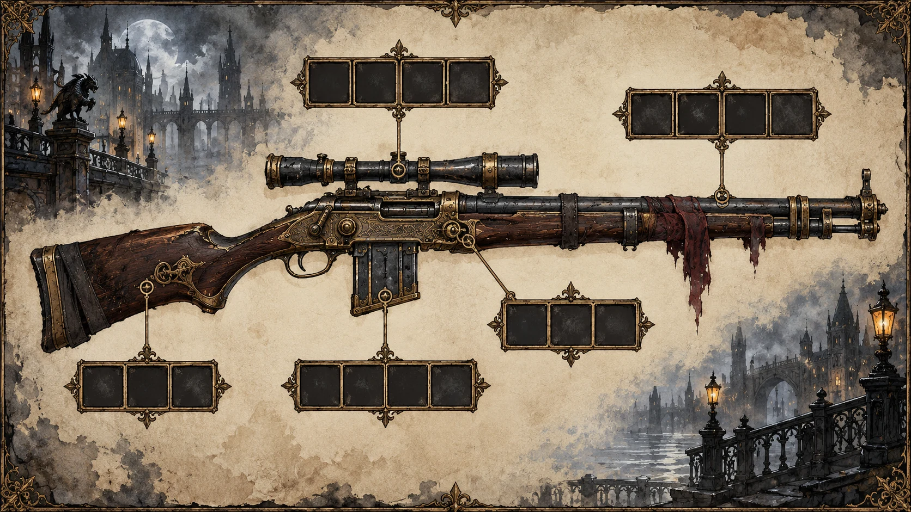
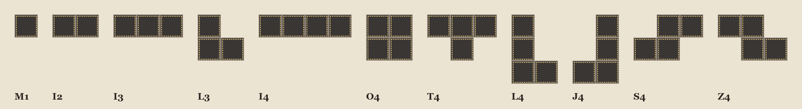

# A. Weapon Modules

A module is a part installed into the cells of a weapon section (sight, magazine, stock, frame, barrel). Its art must have **the exact shape of its cells** — the player places it on the weapon tablet like a puzzle piece. The game rotates modules, so draw each one in its base orientation (as in the template).



## Shapes and templates

One cell = **256×256 px** in the game. Attach the template named in the prompt from `docs/assets/templates/modules/`: the dark area is the part, the dashed line is the safe zone.



| Shape | Cells | Description | Game size | Ask ChatGPT for |
|---|---|---|---|---|
| M1 | 1 | a single square cell | 256×256 | 1:1 (1024×1024) |
| I2 | 2 | two cells side by side (a 2×1 bar) | 512×256 | 3:2 landscape (1536×1024) |
| I3 | 3 | three cells in a row (a 3×1 bar) | 768×256 | 3:2 landscape (1536×1024) |
| L3 | 3 | a corner of three cells: one on top, two below (left one under it) | 512×512 | 1:1 (1024×1024) |
| I4 | 4 | four cells in a row (a 4×1 bar) | 1024×256 | 3:2 landscape (1536×1024) |
| O4 | 4 | a 2×2 square of four cells | 512×512 | 1:1 (1024×1024) |
| T4 | 4 | a T of four cells: three in a row on top, one under the middle | 768×512 | 3:2 landscape (1536×1024) |
| L4 | 4 | an L of four cells: three stacked vertically, one to the right of the bottom cell | 512×768 | 2:3 portrait (1024×1536) |
| J4 | 4 | a J of four cells: three stacked vertically, one to the left of the bottom cell | 512×768 | 2:3 portrait (1024×1536) |
| S4 | 4 | an S of four cells: two on top shifted right, two below shifted left | 768×512 | 3:2 landscape (1536×1024) |
| Z4 | 4 | a Z of four cells: two on top shifted left, two below shifted right | 768×512 | 3:2 landscape (1536×1024) |

> ChatGPT only outputs 1:1, 3:2 or 2:3. `tools/import_art.py` scales every module to its exact size and cuts away everything outside its cells — just keep the part centred and filling the shape.

## Cell types and materials

| Cell type | Materials and colour | Unlocked by |
|---|---|---|
| GEAR (mechanical) | brass, blued steel, rivets, springs, warm gold highlights, no glow | Start (Mechanic web) |
| SPARK (electric) | copper coils, glass, porcelain insulators, a cold blue glow (#6FA8FF) and thin electric arcs | Mechanic web |
| BLOOD (beast) | bone, sinew, leather, glass vials with dark red ichor, organic shapes, a faint red glow | Monster web (the Voice) |

## Styles

```text
MODULE STYLE (after the style block):
A single weapon part seen from directly above (top-down, orthographic, no perspective),
as if laid flat on a workbench. Same rendering as the attached resource icons:
thick dark ink outline, painted metal with scratches and wear, warm light from the top-left.
Transparent background. No table, no frame, no grid, no cell borders, no shadow outside the part.
```

## Catalog

| Module | Section | Shape | Cell | Effect in game |
|---|---|---|---|---|
| Harpoon Launcher | barrel | I3 | gear | Adds card: Harpoon Shot. |
| Rifled Barrel | barrel | I4 | gear | Shots deal +2 damage. |
| Coil Accelerator | barrel | I2 | spark | Next to a Harpoon Launcher: Harpoon Shot becomes Shock Harpoon. |
| Flame Nozzle | barrel | L3 | spark | Adds card: Gout of Flame. |
| Net Caster | barrel | I3 | gear | On capture contracts adds card: Iron Net. |
| Brass Scope | sight | I2 | gear | Shots at body parts deal +3 damage. |
| Lantern Lens | sight | M1 | spark | Adds card: Flash. |
| Eye of the Hound | sight | M1 | blood | Start of the fight: see the creature's next moves. |
| Drum Magazine | magazine | O4 | gear | +2 max ammo. |
| Quick Loader | magazine | I2 | gear | Reload also draws 1 more card. |
| Ichor Cartridges | magazine | L3 | blood | Shots apply 1 Bleed. |
| Capacitor Bank | magazine | T4 | spark | Adds card: Overcharge. |
| Recoil Spring | stock | S4 | gear | Shots also give 2 block. |
| Bayonet Mount | stock | L4 | gear | Adds card: Bayonet Thrust. |
| Bone Brace | stock | Z4 | blood | Rage cards cost 1 less HP. |
| Gyro Stabilizer | frame | T4 | gear | First turn: draw 1 more card. |
| Galvanic Core | frame | O4 | spark | First turn: +1 AP. |
| Vein Lattice | frame | I4 | blood | Bleed you apply is 1 stack stronger. |
| Serrated Rail | frame | J4 | gear | Adds card: Serrated Edge. |
| Smoke Vent | frame | L4 | gear | Adds card: Smoke Screen. |

## Prompts

File: `assets/modules/<MODULE_ID>__module__normal.png`, e.g. `CAPACITOR_BANK__module__normal.png`.

### Harpoon Launcher — `HARPOON_LAUNCHER` · I3 · gear

```text
[STYLE BLOCK]
[MODULE STYLE]
Attached: SHAPE__I3.png (exact shape of the part), RESOURCE icons (style reference),
WEAPON__tablet (the rifle these parts are installed into).
Weapon module "Harpoon Launcher" for a monster hunter's rifle — barrel section.
Cell type GEAR (mechanical): brass, blued steel, rivets, springs, warm gold highlights, no glow.
The part: a short brass harpoon-gun barrel with a barbed steel harpoon loaded in it and a coiled chain wrapped along the side.
SHAPE I3: three cells in a row (a 3×1 bar) — 3×1 cells.
Make the part fill the dark area of the attached template edge to edge, following its outline;
keep the important details inside the dashed inner lines. Everything outside the shape is transparent.
Do not draw the template's grid or dashed lines.
Output: transparent PNG, aspect 3:2 landscape (1536×1024).
```

### Rifled Barrel — `RIFLED_BARREL` · I4 · gear

```text
[STYLE BLOCK]
[MODULE STYLE]
Attached: SHAPE__I4.png (exact shape of the part), RESOURCE icons (style reference),
WEAPON__tablet (the rifle these parts are installed into).
Weapon module "Rifled Barrel" for a monster hunter's rifle — barrel section.
Cell type GEAR (mechanical): brass, blued steel, rivets, springs, warm gold highlights, no glow.
The part: a long blued-steel barrel with brass bands and small cut-away windows showing spiral rifling inside.
SHAPE I4: four cells in a row (a 4×1 bar) — 4×1 cells.
Make the part fill the dark area of the attached template edge to edge, following its outline;
keep the important details inside the dashed inner lines. Everything outside the shape is transparent.
Do not draw the template's grid or dashed lines.
Output: transparent PNG, aspect 3:2 landscape (1536×1024).
```

### Coil Accelerator — `COIL_ACCELERATOR` · I2 · spark

```text
[STYLE BLOCK]
[MODULE STYLE]
Attached: SHAPE__I2.png (exact shape of the part), RESOURCE icons (style reference),
WEAPON__tablet (the rifle these parts are installed into).
Weapon module "Coil Accelerator" for a monster hunter's rifle — barrel section.
Cell type SPARK (electric): copper coils, glass, porcelain insulators, a cold blue glow (#6FA8FF) and thin electric arcs.
The part: a short tube wrapped in stacked copper coil rings, thin blue electric arcs jumping between the rings.
SHAPE I2: two cells side by side (a 2×1 bar) — 2×1 cells.
Make the part fill the dark area of the attached template edge to edge, following its outline;
keep the important details inside the dashed inner lines. Everything outside the shape is transparent.
Do not draw the template's grid or dashed lines.
Output: transparent PNG, aspect 3:2 landscape (1536×1024).
```

### Flame Nozzle — `FLAME_NOZZLE` · L3 · spark

```text
[STYLE BLOCK]
[MODULE STYLE]
Attached: SHAPE__L3.png (exact shape of the part), RESOURCE icons (style reference),
WEAPON__tablet (the rifle these parts are installed into).
Weapon module "Flame Nozzle" for a monster hunter's rifle — barrel section.
Cell type SPARK (electric): copper coils, glass, porcelain insulators, a cold blue glow (#6FA8FF) and thin electric arcs.
The part: an angled heat-blued nozzle with a tiny pilot flame, a small round fuel tank and a spark igniter with a blue glow.
SHAPE L3: a corner of three cells: one on top, two below (left one under it) — 2×2 cells.
Make the part fill the dark area of the attached template edge to edge, following its outline;
keep the important details inside the dashed inner lines. Everything outside the shape is transparent.
Do not draw the template's grid or dashed lines.
Output: transparent PNG, aspect 1:1 (1024×1024).
```

### Net Caster — `NET_CASTER` · I3 · gear

```text
[STYLE BLOCK]
[MODULE STYLE]
Attached: SHAPE__I3.png (exact shape of the part), RESOURCE icons (style reference),
WEAPON__tablet (the rifle these parts are installed into).
Weapon module "Net Caster" for a monster hunter's rifle — barrel section.
Cell type GEAR (mechanical): brass, blued steel, rivets, springs, warm gold highlights, no glow.
The part: a wide-mouthed launcher tube with a folded iron-wire net and small lead weights sticking out of its mouth.
SHAPE I3: three cells in a row (a 3×1 bar) — 3×1 cells.
Make the part fill the dark area of the attached template edge to edge, following its outline;
keep the important details inside the dashed inner lines. Everything outside the shape is transparent.
Do not draw the template's grid or dashed lines.
Output: transparent PNG, aspect 3:2 landscape (1536×1024).
```

### Brass Scope — `BRASS_SCOPE` · I2 · gear

```text
[STYLE BLOCK]
[MODULE STYLE]
Attached: SHAPE__I2.png (exact shape of the part), RESOURCE icons (style reference),
WEAPON__tablet (the rifle these parts are installed into).
Weapon module "Brass Scope" for a monster hunter's rifle — sight section.
Cell type GEAR (mechanical): brass, blued steel, rivets, springs, warm gold highlights, no glow.
The part: a long brass telescopic sight with adjustment knobs and a lens that faintly shows a crosshair.
SHAPE I2: two cells side by side (a 2×1 bar) — 2×1 cells.
Make the part fill the dark area of the attached template edge to edge, following its outline;
keep the important details inside the dashed inner lines. Everything outside the shape is transparent.
Do not draw the template's grid or dashed lines.
Output: transparent PNG, aspect 3:2 landscape (1536×1024).
```

### Lantern Lens — `LANTERN_LENS` · M1 · spark

```text
[STYLE BLOCK]
[MODULE STYLE]
Attached: SHAPE__M1.png (exact shape of the part), RESOURCE icons (style reference),
WEAPON__tablet (the rifle these parts are installed into).
Weapon module "Lantern Lens" for a monster hunter's rifle — sight section.
Cell type SPARK (electric): copper coils, glass, porcelain insulators, a cold blue glow (#6FA8FF) and thin electric arcs.
The part: a small round lens in a brass ring with a tiny caged electric bulb glowing behind it.
SHAPE M1: a single square cell — 1×1 cells.
Make the part fill the dark area of the attached template edge to edge, following its outline;
keep the important details inside the dashed inner lines. Everything outside the shape is transparent.
Do not draw the template's grid or dashed lines.
Output: transparent PNG, aspect 1:1 (1024×1024).
```

### Eye of the Hound — `HOUND_EYE` · M1 · blood

```text
[STYLE BLOCK]
[MODULE STYLE]
Attached: SHAPE__M1.png (exact shape of the part), RESOURCE icons (style reference),
WEAPON__tablet (the rifle these parts are installed into).
Weapon module "Eye of the Hound" for a monster hunter's rifle — sight section.
Cell type BLOOD (beast): bone, sinew, leather, glass vials with dark red ichor, organic shapes, a faint red glow.
The part: a preserved yellow beast eye floating in a glass sphere with a brass rim, thin red veins in the liquid.
SHAPE M1: a single square cell — 1×1 cells.
Make the part fill the dark area of the attached template edge to edge, following its outline;
keep the important details inside the dashed inner lines. Everything outside the shape is transparent.
Do not draw the template's grid or dashed lines.
Output: transparent PNG, aspect 1:1 (1024×1024).
```

### Drum Magazine — `DRUM_MAGAZINE` · O4 · gear

```text
[STYLE BLOCK]
[MODULE STYLE]
Attached: SHAPE__O4.png (exact shape of the part), RESOURCE icons (style reference),
WEAPON__tablet (the rifle these parts are installed into).
Weapon module "Drum Magazine" for a monster hunter's rifle — magazine section.
Cell type GEAR (mechanical): brass, blued steel, rivets, springs, warm gold highlights, no glow.
The part: a round riveted drum magazine with a small window showing rows of brass cartridges.
SHAPE O4: a 2×2 square of four cells — 2×2 cells.
Make the part fill the dark area of the attached template edge to edge, following its outline;
keep the important details inside the dashed inner lines. Everything outside the shape is transparent.
Do not draw the template's grid or dashed lines.
Output: transparent PNG, aspect 1:1 (1024×1024).
```

### Quick Loader — `QUICK_LOADER` · I2 · gear

```text
[STYLE BLOCK]
[MODULE STYLE]
Attached: SHAPE__I2.png (exact shape of the part), RESOURCE icons (style reference),
WEAPON__tablet (the rifle these parts are installed into).
Weapon module "Quick Loader" for a monster hunter's rifle — magazine section.
Cell type GEAR (mechanical): brass, blued steel, rivets, springs, warm gold highlights, no glow.
The part: a spring-loaded speed-loader clip holding a neat row of brass cartridges.
SHAPE I2: two cells side by side (a 2×1 bar) — 2×1 cells.
Make the part fill the dark area of the attached template edge to edge, following its outline;
keep the important details inside the dashed inner lines. Everything outside the shape is transparent.
Do not draw the template's grid or dashed lines.
Output: transparent PNG, aspect 3:2 landscape (1536×1024).
```

### Ichor Cartridges — `ICHOR_CARTRIDGES` · L3 · blood

```text
[STYLE BLOCK]
[MODULE STYLE]
Attached: SHAPE__L3.png (exact shape of the part), RESOURCE icons (style reference),
WEAPON__tablet (the rifle these parts are installed into).
Weapon module "Ichor Cartridges" for a monster hunter's rifle — magazine section.
Cell type BLOOD (beast): bone, sinew, leather, glass vials with dark red ichor, organic shapes, a faint red glow.
The part: glass-bodied cartridges filled with dark red ichor, held in a stained leather bandolier strip.
SHAPE L3: a corner of three cells: one on top, two below (left one under it) — 2×2 cells.
Make the part fill the dark area of the attached template edge to edge, following its outline;
keep the important details inside the dashed inner lines. Everything outside the shape is transparent.
Do not draw the template's grid or dashed lines.
Output: transparent PNG, aspect 1:1 (1024×1024).
```

### Capacitor Bank — `CAPACITOR_BANK` · T4 · spark

```text
[STYLE BLOCK]
[MODULE STYLE]
Attached: SHAPE__T4.png (exact shape of the part), RESOURCE icons (style reference),
WEAPON__tablet (the rifle these parts are installed into).
Weapon module "Capacitor Bank" for a monster hunter's rifle — magazine section.
Cell type SPARK (electric): copper coils, glass, porcelain insulators, a cold blue glow (#6FA8FF) and thin electric arcs.
The part: three glass capacitor jars with copper caps linked by braided cables, a cold blue glow inside.
SHAPE T4: a T of four cells: three in a row on top, one under the middle — 3×2 cells.
Make the part fill the dark area of the attached template edge to edge, following its outline;
keep the important details inside the dashed inner lines. Everything outside the shape is transparent.
Do not draw the template's grid or dashed lines.
Output: transparent PNG, aspect 3:2 landscape (1536×1024).
```

### Recoil Spring — `RECOIL_SPRING` · S4 · gear

```text
[STYLE BLOCK]
[MODULE STYLE]
Attached: SHAPE__S4.png (exact shape of the part), RESOURCE icons (style reference),
WEAPON__tablet (the rifle these parts are installed into).
Weapon module "Recoil Spring" for a monster hunter's rifle — stock section.
Cell type GEAR (mechanical): brass, blued steel, rivets, springs, warm gold highlights, no glow.
The part: a heavy coiled spring assembly with two pistons, brass end caps and oily steel guides.
SHAPE S4: an S of four cells: two on top shifted right, two below shifted left — 3×2 cells.
Make the part fill the dark area of the attached template edge to edge, following its outline;
keep the important details inside the dashed inner lines. Everything outside the shape is transparent.
Do not draw the template's grid or dashed lines.
Output: transparent PNG, aspect 3:2 landscape (1536×1024).
```

### Bayonet Mount — `BAYONET_MOUNT` · L4 · gear

```text
[STYLE BLOCK]
[MODULE STYLE]
Attached: SHAPE__L4.png (exact shape of the part), RESOURCE icons (style reference),
WEAPON__tablet (the rifle these parts are installed into).
Weapon module "Bayonet Mount" for a monster hunter's rifle — stock section.
Cell type GEAR (mechanical): brass, blued steel, rivets, springs, warm gold highlights, no glow.
The part: a folding steel bayonet blade on a hinged mount with a locking lever.
SHAPE L4: an L of four cells: three stacked vertically, one to the right of the bottom cell — 2×3 cells.
Make the part fill the dark area of the attached template edge to edge, following its outline;
keep the important details inside the dashed inner lines. Everything outside the shape is transparent.
Do not draw the template's grid or dashed lines.
Output: transparent PNG, aspect 2:3 portrait (1024×1536).
```

### Bone Brace — `BONE_BRACE` · Z4 · blood

```text
[STYLE BLOCK]
[MODULE STYLE]
Attached: SHAPE__Z4.png (exact shape of the part), RESOURCE icons (style reference),
WEAPON__tablet (the rifle these parts are installed into).
Weapon module "Bone Brace" for a monster hunter's rifle — stock section.
Cell type BLOOD (beast): bone, sinew, leather, glass vials with dark red ichor, organic shapes, a faint red glow.
The part: carved bone struts lashed together with sinew and iron wire, old dark blood stains in the cracks.
SHAPE Z4: a Z of four cells: two on top shifted left, two below shifted right — 3×2 cells.
Make the part fill the dark area of the attached template edge to edge, following its outline;
keep the important details inside the dashed inner lines. Everything outside the shape is transparent.
Do not draw the template's grid or dashed lines.
Output: transparent PNG, aspect 3:2 landscape (1536×1024).
```

### Gyro Stabilizer — `GYRO_STABILIZER` · T4 · gear

```text
[STYLE BLOCK]
[MODULE STYLE]
Attached: SHAPE__T4.png (exact shape of the part), RESOURCE icons (style reference),
WEAPON__tablet (the rifle these parts are installed into).
Weapon module "Gyro Stabilizer" for a monster hunter's rifle — frame section.
Cell type GEAR (mechanical): brass, blued steel, rivets, springs, warm gold highlights, no glow.
The part: nested gyroscope rings spinning inside a brass cage on a steel base.
SHAPE T4: a T of four cells: three in a row on top, one under the middle — 3×2 cells.
Make the part fill the dark area of the attached template edge to edge, following its outline;
keep the important details inside the dashed inner lines. Everything outside the shape is transparent.
Do not draw the template's grid or dashed lines.
Output: transparent PNG, aspect 3:2 landscape (1536×1024).
```

### Galvanic Core — `GALVANIC_CORE` · O4 · spark

```text
[STYLE BLOCK]
[MODULE STYLE]
Attached: SHAPE__O4.png (exact shape of the part), RESOURCE icons (style reference),
WEAPON__tablet (the rifle these parts are installed into).
Weapon module "Galvanic Core" for a monster hunter's rifle — frame section.
Cell type SPARK (electric): copper coils, glass, porcelain insulators, a cold blue glow (#6FA8FF) and thin electric arcs.
The part: a cylindrical battery core in an iron cage with captured lightning crawling inside thick glass.
SHAPE O4: a 2×2 square of four cells — 2×2 cells.
Make the part fill the dark area of the attached template edge to edge, following its outline;
keep the important details inside the dashed inner lines. Everything outside the shape is transparent.
Do not draw the template's grid or dashed lines.
Output: transparent PNG, aspect 1:1 (1024×1024).
```

### Vein Lattice — `VEIN_LATTICE` · I4 · blood

```text
[STYLE BLOCK]
[MODULE STYLE]
Attached: SHAPE__I4.png (exact shape of the part), RESOURCE icons (style reference),
WEAPON__tablet (the rifle these parts are installed into).
Weapon module "Vein Lattice" for a monster hunter's rifle — frame section.
Cell type BLOOD (beast): bone, sinew, leather, glass vials with dark red ichor, organic shapes, a faint red glow.
The part: a lattice of glass tubes with dark red fluid pumping through them, small brass valves, like a mechanical vein.
SHAPE I4: four cells in a row (a 4×1 bar) — 4×1 cells.
Make the part fill the dark area of the attached template edge to edge, following its outline;
keep the important details inside the dashed inner lines. Everything outside the shape is transparent.
Do not draw the template's grid or dashed lines.
Output: transparent PNG, aspect 3:2 landscape (1536×1024).
```

### Serrated Rail — `SERRATED_RAIL` · J4 · gear

```text
[STYLE BLOCK]
[MODULE STYLE]
Attached: SHAPE__J4.png (exact shape of the part), RESOURCE icons (style reference),
WEAPON__tablet (the rifle these parts are installed into).
Weapon module "Serrated Rail" for a monster hunter's rifle — frame section.
Cell type GEAR (mechanical): brass, blued steel, rivets, springs, warm gold highlights, no glow.
The part: a steel rail with a saw-tooth blade along its length and small rivets.
SHAPE J4: a J of four cells: three stacked vertically, one to the left of the bottom cell — 2×3 cells.
Make the part fill the dark area of the attached template edge to edge, following its outline;
keep the important details inside the dashed inner lines. Everything outside the shape is transparent.
Do not draw the template's grid or dashed lines.
Output: transparent PNG, aspect 2:3 portrait (1024×1536).
```

### Smoke Vent — `SMOKE_VENT` · L4 · gear

```text
[STYLE BLOCK]
[MODULE STYLE]
Attached: SHAPE__L4.png (exact shape of the part), RESOURCE icons (style reference),
WEAPON__tablet (the rifle these parts are installed into).
Weapon module "Smoke Vent" for a monster hunter's rifle — frame section.
Cell type GEAR (mechanical): brass, blued steel, rivets, springs, warm gold highlights, no glow.
The part: small leather bellows connected to sooty vent pipes, a thin puff of grey smoke.
SHAPE L4: an L of four cells: three stacked vertically, one to the right of the bottom cell — 2×3 cells.
Make the part fill the dark area of the attached template edge to edge, following its outline;
keep the important details inside the dashed inner lines. Everything outside the shape is transparent.
Do not draw the template's grid or dashed lines.
Output: transparent PNG, aspect 2:3 portrait (1024×1536).
```
