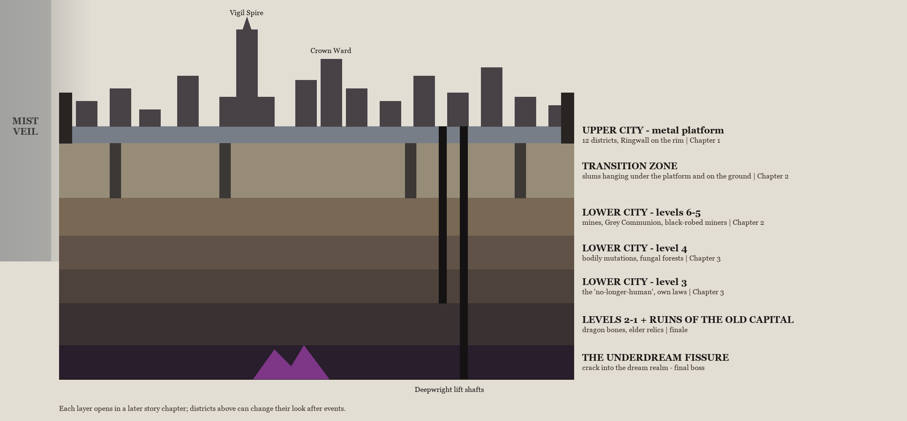
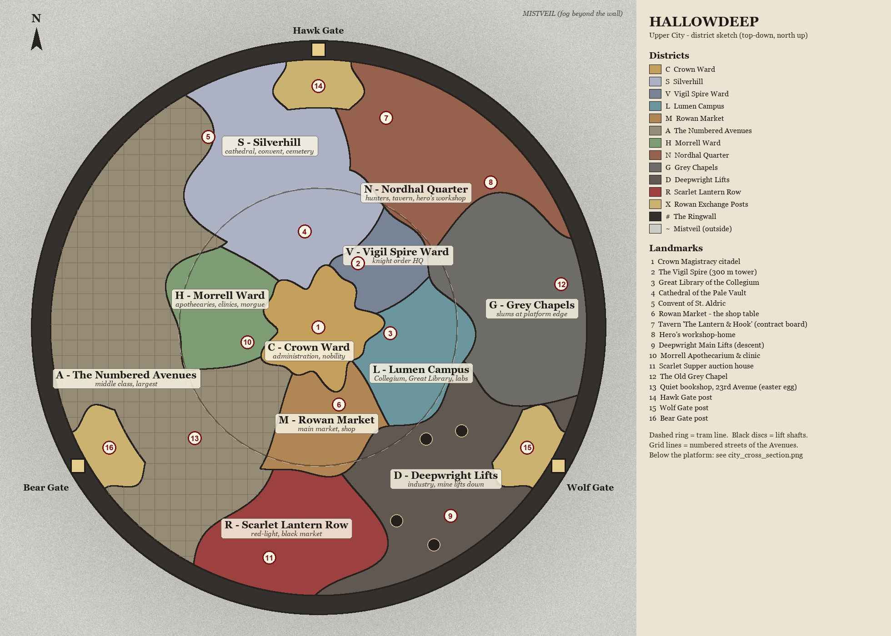

# 13. The City of Hallowdeep

## 13.1 Overview

- Hallowdeep is the capital of a land sealed by the **Mistveil** — a wall of living fog raised long ago by the **Four Elder Mothers** to keep the **Underdream** and its **dreamspawn** out. Cracks in the Mistveil let creatures through; that is why hunters exist.
- The city is built **on the ruins of an ancient royal capital**.
- The **Upper City** is an artificial city of metal on a huge round platform, separated from the ground and enclosed by the **Ringwall** with three gates.
- Streets near the centre have names; the rest are numbered ('4th Avenue', 'Street K').
- Under the platform lie the **Transition Zone** and the **Lower City** (levels 6 → 1), isolated for centuries after the Grey Plague. The deeper the level, the stronger the mutation: levels 6–5 are still human, level 4 shows bodily mutation, level 3 dwellers no longer consider themselves human.
- Technology looks like the 1880s–1890s, but mechanics and biotechnology are far ahead: lifts, trams, electric searchlights, artificial humans.
- The only official government is the **Crown Magistracy** in the Crown Ward, and it is weakening. Powerful organisations (Collegium, Iron Vigil, Rowan Exchange, Deepwright) are tolerated while they are useful.

## 13.2 Vertical layers



*Figure 2 — Cross-section of Hallowdeep (docs/assets/map/city_cross_section.png)*

| Layer | Opens in | Short description |
|---|---|---|
| Upper City | Prologue / Chapter I | 12 districts on the metal platform inside the Ringwall. |
| Transition Zone | Chapter II | Slums hanging under the platform and on the ground, eternal shadow, dripping water, 'market from below'. Danger P. |
| Levels 6–5 | Chapter II | Deepwright mines, villages of black-robed miners, Grey Communion rules. Trade with the Umbral kin. Danger P. |
| Level 4 | Chapter III | Bodily mutations, alien ecology, fungal forests. Danger D. |
| Level 3 | Chapter III | The 'no-longer-human': animal eyes, powers, their own laws and culture. Danger D. |
| Levels 2–1 | Chapter III | Close to the Mistveil, cracks into the Underdream. Danger S. |
| Ruins of the Old Capital | Chapter III / finale | Under everything: catacombs, dragon bones (top crafting material), shards of the Ember Tablets, ancient shrines. |



*Figure 1 — Hallowdeep Upper City: district sketch, north is up (docs/assets/map/city_sketch.png)*

## 13.3 How to read the sketch

- **Top-down view, north is up.** The large circle is the metal platform; the dark ring is the **Ringwall**; the grey noise outside is the **Mistveil** (fog wasteland, not walkable).
- **Crown Ward** sits in the exact centre and is the highest point. Around it is the **inner ring** (Silverhill inner part, Vigil Spire Ward, Lumen Campus, Rowan Market, Morrell Ward, the inner Avenues).
- The **outer ring** runs to the wall: Silverhill (north-west), Nordhal Quarter (north-east), Grey Chapels (east), Deepwright Lifts (south-east), Scarlet Lantern Row (south), the Numbered Avenues (the whole west and south-west).
- Three **gates**: Hawk Gate (north), Wolf Gate (south-east), Bear Gate (south-west). Each gate has a Rowan Exchange post; together they form a **triangle** around the Crown Ward.
- The **dashed ring** is the tram line between inner and outer rings. **Black discs** in the south-east are lift shafts going down. **Grid lines** mark the numbered streets of the Avenues.
- **Red numbers** are landmarks (legend on the right side of the sketch).
- Districts are deliberately of **different sizes and shapes**: the Avenues are the biggest, the Vigil Spire Ward is a small wedge, the Exchange posts are tiny enclaves.

## 13.4 ASCII grid (for ChatGPT and for code)

The same layout sampled as a text grid. Each cell is printed as two characters so it looks square in a monospace font. Two-digit numbers are landmarks. File: `docs/assets/map/city_grid.txt` — attach it together with the PNG when asking ChatGPT for art.

```text
~~~~~~~~~~~~~~~~~~~~~~~~~~~~~~~~~~~~~~~~~~~~~~~~~~~~~~~~~~~~~~~~~~~~~~~~~~~~~~~~~~~~~~~~
~~~~~~~~~~~~~~~~~~~~~~~~~~~~~~~~~~####################~~~~~~~~~~~~~~~~~~~~~~~~~~~~~~~~~~
~~~~~~~~~~~~~~~~~~~~~~~~~~~~############XXXXXXXX############~~~~~~~~~~~~~~~~~~~~~~~~~~~~
~~~~~~~~~~~~~~~~~~~~~~~~######SSSSSSSSXXXXXXXXXXXXNNNNNNNN######~~~~~~~~~~~~~~~~~~~~~~~~
~~~~~~~~~~~~~~~~~~~~######SSSSSSSSSSSSXXXXXX14XXXXNNNNNNNNNNNN######~~~~~~~~~~~~~~~~~~~~
~~~~~~~~~~~~~~~~~~####AAAASSSSSSSSSSSSXXXXXXXXXXXXNNNNNNNNNNNNNNNN####~~~~~~~~~~~~~~~~~~
~~~~~~~~~~~~~~~~####AAAAAAAASSSSSSSSSSSSSSSSSSNNNNNN07NNNNNNNNNNNNNN####~~~~~~~~~~~~~~~~
~~~~~~~~~~~~~~####AAAAAAAAAASSSSSSSSSSSSSSSSSSSSNNNNNNNNNNNNNNNNNNNNNN####~~~~~~~~~~~~~~
~~~~~~~~~~~~####AAAAAAAAAA05SSSSSSSSSSSSSSSSSSSSNNNNNNNNNNNNNNNNNNNNNNNN####~~~~~~~~~~~~
~~~~~~~~~~####AAAAAAAAAAAAAASSSSSSSSSSSSSSSSSSSSNNNNNNNNNNNNNNNNNNNNNNNNNN####~~~~~~~~~~
~~~~~~~~####AAAAAAAAAAAAAASSSSSSSSSSSSSSSSSSSSSSNNNNNNNNNNNNNNNNNNNNNNNNNNNN####~~~~~~~~
~~~~~~~~##AAAAAAAAAAAAAASSSSSSSSSSSSSSSSSSSSSSSSSSSSNNNNNNNNNNNNNNNN08NNNNNNNN##~~~~~~~~
~~~~~~####AAAAAAAAAAAAAASSSSSSSSSSSSSSSSSSSSSSSSSSSSNNNNNNNNNNNNNNNNGGGGGGNNNN####~~~~~~
~~~~~~##AAAAAAAAAAAAAAAASSSSSSSSSSSSSSSSSSSSSSSSSSSSSSNNNNNNNNNNNNGGGGGGGGGGNNNN##~~~~~~
~~~~####AAAAAAAAAAAAAAAAAASSSSSSSSSSSSSSSS04SSSSSSSSVVVVNNNNNNNNGGGGGGGGGGGGGGNN####~~~~
~~~~##AAAAAAAAAAAAAAAAAAAAAAAASSSSSSSSSSSSSSSSSSSSVVVVVVVVVVNNGGGGGGGGGGGGGGGGGGGG##~~~~
~~~~##AAAAAAAAAAAAAAAAAAAAAAHHHHSSSSSSSSSSSSSSSSVVVVVVVVVVVVGGGGGGGGGGGGGGGGGGGGGG##~~~~
~~####AAAAAAAAAAAAAAAAHHHHHHHHHHHHHHSSSSSSSSCCVV02VVVVVVVVVVGGGGGGGGGGGGGGGGGGGGGG####~~
~~####AAAAAAAAAAAAAAAAHHHHHHHHHHHHHHHHSSSSSSCCCCVVVVVVVVVVVVGGGGGGGGGGGGGGGGGG12GG####~~
~~####AAAAAAAAAAAAAAAAHHHHHHHHHHHHHHHHCCCCCCCCCCCCVVVVVVVVLLLLGGGGGGGGGGGGGGGGGGGG####~~
~~##AAAAAAAAAAAAAAAAAAHHHHHHHHHHHHHHCCCCCCCCCCCCCCVVVVLLLLLLLLLLGGGGGGGGGGGGGGGGGGGG##~~
~~##AAAAAAAAAAAAAAAAAAAAHHHHHHHHHHHHCCCCCCCCCCCCCCCCCCLLLLLLLLLLLLGGGGGGGGGGGGGGGGGG##~~
~~##AAAAAAAAAAAAAAAAAAAAHHHHHHHHHHHHHHCCCCCC01CCCCCCLL03LLLLLLLLLLLLGGGGGGGGGGGGGGGG##~~
~~##AAAAAAAAAAAAAAAAAAAAHHHHHHHH10HHCCCCCCCCCCCCCCLLLLLLLLLLLLLLLLGGGGGGGGGGGGGGGGGG##~~
~~####AAAAAAAAAAAAAAAAAAHHHHHHHHHHAACCCCCCCCCCCCLLLLLLLLLLLLLLLLLLGGGGGGGGGGGGGGGG####~~
~~####AAAAAAAAAAAAAAAAAAAAAAAAAAAAAAAAAAMMMMCCCCMMLLLLLLLLLLLLLLDDGGGGGGGGGGGGGGGG####~~
~~####AAAAAAAAAAAAAAAAAAAAAAAAAAAAAAAAAAMMMMMMCCMMMMLLLLLLLLLLDDDDDDGGGGGGGGGGGGGG####~~
~~~~##AAAAAAAAAAAAAAAAAAAAAAAAAAAAAAAAMMMMMMMM06MMMMLLLLLLLLLLDDDDDDDDGGGGGGGGDDDD##~~~~
~~~~##AAAAXXXXAAAAAAAAAAAAAAAAAAAAAAAAMMMMMMMMMMMMMMMMLLLLLLDDDDDDDDDDDDDDXXXXDDDD##~~~~
~~~~####XXXXXXXXAAAAAAAAAAAAAAAAAAAAAAMMMMMMMMMMMMMMDDDDDDDDDDDDDDDDDDDDXXXXXXXX####~~~~
~~~~~~##XXXX16XXAAAAAAAA13AAAAAAAAAAAAMMMMMMMMMMMMMMDDDDDDDDDDDDDDDDDDDDXX15XXXX##~~~~~~
~~~~~~####XXXXXXXXAAAAAAAAAAAAAAAAAAMMMMMMMMMMMMMMDDDDDDDDDDDDDDDDDDDDXXXXXXXX####~~~~~~
~~~~~~~~##XXXXXXXXAAAAAAAAAAAAAAAAAAAARRRRMMMMMMDDDDDDDDDDDDDDDDDDDDDDXXXXXXXX##~~~~~~~~
~~~~~~~~####XXXXXXAAAAAAAAAAAAAAAAAARRRRRRRRRRRRDDDDDDDDDDDDDDDDDDDDDDXXXXXX####~~~~~~~~
~~~~~~~~~~####AAAAAAAAAAAAAAAAAAAARRRRRRRRRRRRRRRRDDDDDDDDDDDDDDDDDDDDDDDD####~~~~~~~~~~
~~~~~~~~~~~~####AAAAAAAAAAAAAAAARRRRRRRRRRRRRRRRRRRRDDDDDDDDDD09DDDDDDDD####~~~~~~~~~~~~
~~~~~~~~~~~~~~####AAAAAAAAAARRRRRRRRRRRRRRRRRRRRRRRRRRDDDDDDDDDDDDDDDD####~~~~~~~~~~~~~~
~~~~~~~~~~~~~~~~####AAAAAARRRRRRRRRRRRRRRRRRRRRRRRRRRRDDDDDDDDDDDDDD####~~~~~~~~~~~~~~~~
~~~~~~~~~~~~~~~~~~####AAAARRRRRRRRRR11RRRRRRRRRRRRRRRRDDDDDDDDDDDD####~~~~~~~~~~~~~~~~~~
~~~~~~~~~~~~~~~~~~~~######RRRRRRRRRRRRRRRRRRRRRRRRRRDDDDDDDDDD######~~~~~~~~~~~~~~~~~~~~
~~~~~~~~~~~~~~~~~~~~~~~~######RRRRRRRRRRRRRRRRRRDDDDDDDDDD######~~~~~~~~~~~~~~~~~~~~~~~~
~~~~~~~~~~~~~~~~~~~~~~~~~~~~############RRRRDDDD############~~~~~~~~~~~~~~~~~~~~~~~~~~~~
~~~~~~~~~~~~~~~~~~~~~~~~~~~~~~~~~~####################~~~~~~~~~~~~~~~~~~~~~~~~~~~~~~~~~~
~~~~~~~~~~~~~~~~~~~~~~~~~~~~~~~~~~~~~~~~~~~~~~~~~~~~~~~~~~~~~~~~~~~~~~~~~~~~~~~~~~~~~~~~
```

| Symbol | District | Symbol | District |
|---|---|---|---|
| C | Crown Ward | N | Nordhal Quarter |
| S | Silverhill | G | Grey Chapels |
| V | Vigil Spire Ward | D | Deepwright Lifts |
| L | Lumen Campus | R | Scarlet Lantern Row |
| M | Rowan Market | X | Rowan Exchange Posts |
| A | Numbered Avenues | # | The Ringwall |
| H | Morrell Ward | ~ | Mistveil (outside) |

## 13.5 District catalog

Each district is described with the same fields. **Code** is the stable identifier used in data files, saves and art file names (e.g. `art/city/districts/NORDHAL__normal.webp`).

### Crown Ward  [CROWN · C]

| Field | Value |
|---|---|
| Class / size | Administrative / nobility — Small (core) |
| Position | Exact centre of the platform, highest ground. Irregular star shape. Borders every inner district. |
| Controlled by | Crown Magistracy and old noble houses |
| Danger rank | A (contracts lead to P–D) |
| Look | Marble galleries, a citadel of black steel and white stone, clock towers on every square, gas lamps with brass cages, named streets, private gardens under glass domes. |
| Areas (sub-zones) | Citadel Square · The Glass Gardens · Gallery Row (noble mansions) · Clockmakers' Steps |
| Landmarks | 1 — Crown Magistracy citadel |
| Typical monsters | Mimics and doubles, creatures living in mirrors and portraits, mind control. Nobles secretly dabble in black magic. |
| Rumor flavour tags | a servant 'acting differently'; mirrors covered with cloth; one more guest at the ball than invited |
| Gameplay role | Expensive secret contracts with strict deadlines; failure hurts reputation. |

### Silverhill  [SILVERHILL · S]

| Field | Value |
|---|---|
| Class / size | Religious — Large (north-north-west, from the centre to the wall) |
| Position | North and north-west of the Crown Ward up to the Ringwall; west of the Hawk Gate post. |
| Controlled by | Church of the Pale Vault |
| Danger rank | A by day, P by night |
| Look | White cathedrals with moon-shaped rose windows, silver domes, convent walls, terraced cemetery down to the Ringwall, orphanage courtyards. |
| Areas (sub-zones) | Cathedral Close · Convent of St. Aldric · Terraced Cemetery · Orphans' Stair |
| Landmarks | 4 — Cathedral of the Pale Vault; 5 — Convent of St. Aldric |
| Typical monsters | Sleepwalkers, 'Moon children', silver parasites, moth swarms. Hidden truth: the moon they worship is the Masked Moon, a creature wearing a god's skin. |
| Rumor flavour tags | at full moon; smells of incense and blood; the victim was smiling |
| Gameplay role | Long story chain of Chapter I; healing and holy consumables. |

### Vigil Spire Ward  [VIGIL · V]

| Field | Value |
|---|---|
| Class / size | Military order — Small wedge (north-east of the centre) |
| Position | Between Crown Ward and the Nordhal Quarter, north-east of the centre. |
| Controlled by | Order of the Iron Vigil |
| Danger rank | A |
| Look | A 300-metre honeycomb tower with 49 elevators, barracks, drill yards, archive halls, steel banners. |
| Areas (sub-zones) | The Spire · Drill Yards · Archive Halls |
| Landmarks | 2 — The Vigil Spire |
| Typical monsters | Rare: escaped evidence from archives, possessed knights. |
| Rumor flavour tags | armour found empty; orders given by no one; lights in the archive at night |
| Gameplay role | Dossiers on monsters (contract tags revealed early), knight armor blueprints. |

### Lumen Campus  [LUMEN · L]

| Field | Value |
|---|---|
| Class / size | University / science — Medium (east of the centre) |
| Position | East of the Crown Ward, between Vigil Spire Ward (north) and Rowan Market (south-west). |
| Controlled by | Lumen Collegium |
| Danger rank | P (experiments escape) |
| Look | Lecture halls, glass laboratories, chimneys with coloured smoke, the Great Library with a brass dome, mechanical department workshops. |
| Areas (sub-zones) | Great Library · Alchemy Wing · Mechanical Department · Lecture Quad |
| Landmarks | 3 — Great Library of the Collegium (the hero's Library action) |
| Typical monsters | Escaped 'Clay Saints' (artificial humans), victims of transmutation, living formulas. |
| Rumor flavour tags | smell of formalin; glass chiming; the skull opened neatly, like in a lecture |
| Gameplay role | Library actions; buyer of captured creatures; Mechanic blueprints. |

### Rowan Market  [MARKET · M]

| Field | Value |
|---|---|
| Class / size | Trade — Medium (south of the centre) |
| Position | Directly south of the Crown Ward, between the Avenues (west) and Lumen/Deepwright (east). |
| Controlled by | Rowan Exchange |
| Danger rank | A |
| Look | Covered rows, scales, crates, awnings, a central hall with a rowan tree carved in wood. The hero's shop is a wooden table with cards. |
| Areas (sub-zones) | Central Hall · Covered Rows · Crate Yards |
| Landmarks | 6 — Rowan Market, the shop table |
| Typical monsters | Smuggled 'sleeping' creatures in crates, wood parasites, a curse of greed (cursed object). |
| Rumor flavour tags | the cargo moved; a trader went mad with greed; roots through the cobbles |
| Gameplay role | The Shop location. |

### Rowan Exchange Posts  [EXCHANGE · X]

| Field | Value |
|---|---|
| Class / size | Trade enclaves — Three small enclaves at the gates |
| Position | Hawk post at the north gate, Wolf post at the south-east gate, Bear post at the south-west gate. Together they form a triangle around the Crown Ward. |
| Controlled by | Rowan Exchange houses: Harrow (Hawk), Varga (Wolf), Brannoc (Bear) |
| Danger rank | A |
| Look | Fortified warehouses at the gates, totem carvings (eagle / wolf / bear), caravan yards, weighing towers. |
| Areas (sub-zones) | Hawk Post · Wolf Post · Bear Post |
| Landmarks | 14 — Hawk Gate post; 15 — Wolf Gate post; 16 — Bear Gate post |
| Typical monsters | Things that come in from the Mistveil with caravans. |
| Rumor flavour tags | fog on the cargo; a caravan arrived with one driver too many |
| Gameplay role | House-specific shop lines (Hawk = scopes, Bear = armor, Wolf = hunting mechanisms). |

### The Numbered Avenues  [AVENUES · A]

| Field | Value |
|---|---|
| Class / size | Middle class (largest) — Very large (west and south-west, from inner ring to the wall) |
| Position | Whole western half from the Morrell Ward to the Ringwall, and south-west to Scarlet Lantern Row; surrounds the Bear Gate post. |
| Controlled by | Nobody (formally the Magistracy, in practice the Iron Vigil) |
| Danger rank | A, with P hotspots |
| Look | An endless grid of identical streets: '12th Avenue', 'Street K'. Offices, shops, tenement houses, trams. |
| Areas (sub-zones) | 4th Avenue · 23rd Avenue · Tram Depot · Letter Streets (A–Z) · Laundry Canals |
| Landmarks | 13 — the quiet bookshop on 23rd Avenue (easter egg: its rumor can never be investigated — 'Contact not advised') |
| Typical monsters | Everyday horror: something in the drains, in the neighbours' cellar, on the last tram. |
| Rumor flavour tags | wet handprints on windows; children singing in the drains; the last tram arrived empty |
| Gameplay role | Most generated side contracts; good place to farm rumors. |

### Morrell Ward  [MORRELL · H]

| Field | Value |
|---|---|
| Class / size | Medical — Small-medium (west of the centre) |
| Position | West of the Crown Ward, between Silverhill (north) and the Avenues (south and west). |
| Controlled by | House Morrell |
| Danger rank | A |
| Look | Clinics, apothecaries, greenhouses with herbs, a morgue with green lamps. |
| Areas (sub-zones) | Apothecarium · Greenhouses · The Morgue |
| Landmarks | 10 — Morrell Apothecarium & clinic (Hunter's Fall wake-up point) |
| Typical monsters | Patients who did not die, disease-beings, infections from the Lower City. |
| Rumor flavour tags | the corpse was warm a week later; bitter herbal smell; nurses refuse the night shift |
| Gameplay role | Treatment of HP and the Voice; tonics; buys captured creatures. |

### Nordhal Quarter  [NORDHAL · N]

| Field | Value |
|---|---|
| Class / size | Hunters / working class — HOME — Large (north-east, outer ring) |
| Position | North-east from the Hawk Gate post along the Ringwall down to the Grey Chapels. |
| Controlled by | Hunter crews and the old Nordhal families |
| Danger rank | P |
| Look | Dark brick, Nordhal runes on doors, forges, fighting pits, steam from bathhouses. |
| Areas (sub-zones) | Tavern Street · Forge Row · The Pits · Old Rune Yard |
| Landmarks | 7 — Tavern 'The Lantern & Hook' (contract board); 8 — the hero's workshop-home |
| Typical monsters | Infected hunters turning into beasts — a familiar face from the tavern can become a contract. |
| Rumor flavour tags | a howl; human footprints turning into paws; smell of blood and medicine |
| Gameplay role | Hub: tavern, workshop, home. Blood formulas from the Pale Hounds or the Weavers. |

### Grey Chapels  [GREY · G]

| Field | Value |
|---|---|
| Class / size | Slums at the platform edge — Large (east, outer ring) |
| Position | East edge of the platform, between Nordhal (north) and Deepwright Lifts (south). |
| Controlled by | Nobody officially; the Grey Communion secretly |
| Danger rank | P |
| Look | Ruined chapels of a forgotten faith, shanty roofs, grey fog in cellars, bonfires. |
| Areas (sub-zones) | The Old Grey Chapel · Shanty Roofs · Edge Walk (railing over the abyss) |
| Landmarks | 12 — The Old Grey Chapel |
| Typical monsters | Fog corruption, cult summonings, rat swarms. |
| Rumor flavour tags | grey fog in the cellar; prayers to the god in the wall; people with grey eyes |
| Gameplay role | Contact with the Grey Communion; ichor; secret path down in Chapter II. |

### Deepwright Lifts  [DEEPWRIGHT · D]

| Field | Value |
|---|---|
| Class / size | Industrial — Large (south-east) |
| Position | South-east between Lumen/Rowan Market and the Ringwall; contains the Wolf Gate post area. |
| Controlled by | Deepwright Company |
| Danger rank | P, D near the shafts |
| Look | Giant mine lifts going down through the platform, foundries, ore yards, machines roaring, workers in masks. |
| Areas (sub-zones) | Main Lifts · Foundry Line · Ore Yards · Shaft 7 (sealed) |
| Landmarks | 9 — Deepwright Main Lifts (descent to the Lower City) |
| Typical monsters | Burrow Wyrm (rank D: digs, chitin shell, acid), creatures riding up the lifts. |
| Rumor flavour tags | walls eaten through; the floor collapsed; workers heard knocking from below |
| Gameplay role | Best district for Gears/Scrap; the way down in Chapter II. |

### Scarlet Lantern Row  [SCARLET · R]

| Field | Value |
|---|---|
| Class / size | Red-light / black market — Medium (south, outer ring) |
| Position | South, between the Avenues (west) and Deepwright Lifts (east), down to the Ringwall. |
| Controlled by | Scarlet Supper |
| Danger rank | P–D |
| Look | Narrow alleys under red lanterns, brothels, gambling dens, underground auction houses, black magicians' parlours. |
| Areas (sub-zones) | Lantern Alley · The Auction House · Velvet Steps |
| Landmarks | 11 — Scarlet Supper auction house (black market) |
| Typical monsters | Illusions, blood curses, creatures summoned by clients. |
| Rumor flavour tags | a client left without a face; whispering in an unknown tongue; blood on the mirror |
| Gameplay role | Black market; Scarlet Supper contracts. |

### The Ringwall  [WALL · #]

| Field | Value |
|---|---|
| Class / size | Fortification — Ring around the platform |
| Position | Outer rim of the platform with three gates (Hawk N, Wolf SE, Bear SW). |
| Controlled by | Magistracy garrison |
| Danger rank | D during events |
| Look | Black steel bastion, searchlights aimed at the fog, watchtowers, drainage outlets. |
| Areas (sub-zones) | Hawk Gate · Wolf Gate · Bear Gate · Wall Walk |
| Landmarks | Gates 14–16 |
| Typical monsters | Dreamspawn breaking through cracks in the Mistveil. |
| Rumor flavour tags | the searchlights went dark; fog crawled over the wall |
| Gameplay role | Fog Breach events; defence contracts. |

## 13.6 The Lower City and the Ruins

| Layer | Chapter | Description |
|---|---|---|
| Transition Zone | Chapter II | Slums hanging under the platform and on the ground, eternal shadow, dripping water, 'market from below'. Danger P. |
| Levels 6–5 | Chapter II | Deepwright mines, villages of black-robed miners, Grey Communion rules. Trade with the Umbral kin. Danger P. |
| Level 4 | Chapter III | Bodily mutations, alien ecology, fungal forests. Danger D. |
| Level 3 | Chapter III | The 'no-longer-human': animal eyes, powers, their own laws and culture. Danger D. |
| Levels 2–1 | Chapter III | Close to the Mistveil, cracks into the Underdream. Danger S. |
| Ruins of the Old Capital | Chapter III / finale | Under everything: catacombs, dragon bones (top crafting material), shards of the Ember Tablets, ancient shrines. |

> **Note:** The Lower City is not just 'the enemy'. The Grey Communion is an ally with a different truth: the people below hate the Upper City for centuries of oppression. This is a key story choice in Chapter II.
